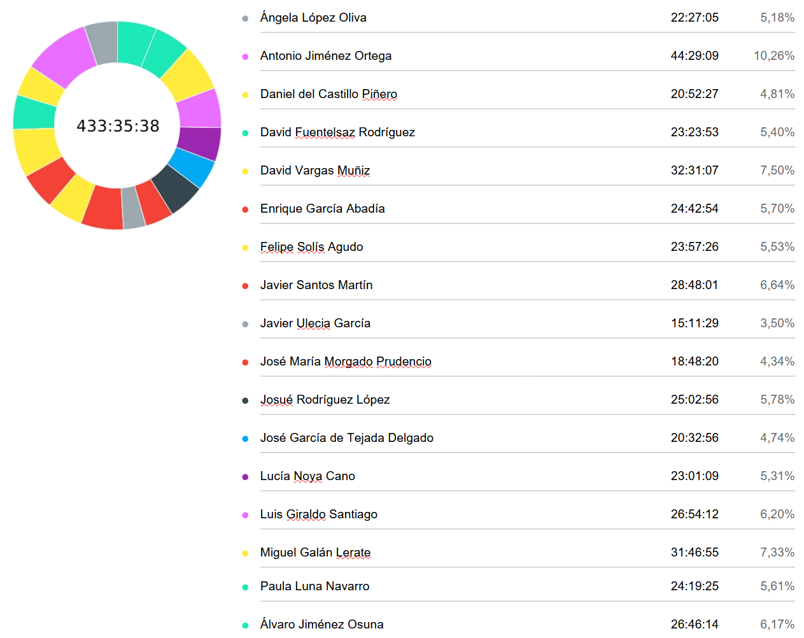

# Time Effort Report

**Fecha:** 30/04/2025  
**Grupo 8:** Infantem  
**Preparing Project Launch**

## Integrantes del Grupo

  

    <ul style="padding-left: 0; list-style: none;">
      <li>Álvaro Jiménez Osuna</li>
      <li>Ángela López Oliva</li>
      <li>Antonio Jiménez Ortega</li>
      <li>Daniel del Castillo Piñero</li>
      <li>David Fuentelsaz Rodríguez</li>
      <li>David Vargas Muñiz</li>
      <li>Enrique García Abadía</li>
      <li>Felipe Solís Agudo</li>
      <li>Javier Santos Martín</li>
    </ul>
  

  

    <ul style="padding-left: 0; list-style: none;">
    <li>Javier Ulecia García</li>
      <li>José García de Tejada Delgado</li>
      <li>Jose Maria Morgado Prudencio</li>
      <li>Josué Rodríguez López López López López</li>
      <li>Lucía Noya Cano</li>
      <li>Luis Giraldo Santiago</li>
      <li>Miguel Galán Lerate</li>
      <li>Paula Luna Navarro</li>
    </ul>
  

## Colaboradores del documento
- Josué Rodríguez López López López
  - Creó la versión inicial del documento
---

## Índice
- [Resumen del tiempo invertido por el equipo](#resumen-del-tiempo-invertido-por-el-equipo)
- [Informe detallado de las horas invertidas por cada miembro del equipo](#informe-detallado-de-las-horas-invertidas-por-cada-miembro-del-equipo)
  - [Ángela López Oliva](#ángela-lópez-oliva)
  - [Antonio Jiménez Ortega](#antonio-jiménez-ortega)
  - [Daniel del Castillo Piñero](#daniel-del-castillo-piñero)
  - [David Fuentelsaz Rodríguez](#david-fuentelsaz-rodríguez)
  - [David Vargas Muñiz](#david-vargas-muñiz)
  - [Enrique García Abadía](#enrique-garcía-abadía)
  - [Felipe Solís Agudo](#felipe-solís-agudo)
  - [Javier Santos Martín](#javier-santos-martín)
  - [Javier Ulecia García](#javier-ulecia-garcía)
  - [José María Morgado Prudencio](#jose-maria-morgado-prudencio)
  - [Josué Rodríguez López López López López](#josué-rodríguez-lópez-lópez)
  - [José García de Tejada Delgado](#josé-garcía-de-tejada-delgado)
  - [Lucía Noya Cano](#lucía-noya-cano)
  - [Luis Giraldo Santiago](#luis-giraldo-santiago)
  - [Miguel Galán Lerate](#miguel-galán-lerate)
  - [Paula Luna Navarro](#paula-luna-navarro)
  - [Álvaro Jiménez Osuna](#álvaro-jiménez-osuna)

## Resumen del tiempo invertido por el equipo

## Informe detallado de las horas invertidas por cada miembro del equipo

#### Ángela López Oliva
| Usuario                       | Tarea                           | Descripción                                                                                                         | Duración (h) |
|-------------------------------|---------------------------------|---------------------------------------------------------------------------------------------------------------------|--------------|
| Angela Lopez Oliva            | Marketing                          | Anuncio #2                                                                                                                                                                 |     02:23:14 |
| Angela Lopez Oliva            | Presentación                       | Presentación                                                                                                                                                               |     00:35:50 |
| Angela Lopez Oliva            | Presentación                       | Presentación                                                                                                                                                               |     00:56:56 |
| Angela Lopez Oliva            | Asistencia a clase                 | Clase                                                                                                                                                                      |     02:00:00 |
| Angela Lopez Oliva            | Marketing                          | Anuncio                                                                                                                                                                    |     01:49:48 |
| Angela Lopez Oliva            | Reuniones                          | Reunión presentación y marketing                                                                                                                                           |     00:21:48 |
| Angela Lopez Oliva            | Marketing                          | Anuncio                                                                                                                                                                    |     00:54:31 |
| Angela Lopez Oliva            | Asistencia a clase                 | Clase                                                                                                                                                                      |     04:00:00 |
| Angela Lopez Oliva            | Reuniones                          | Reunión presentación y marketing                                                                                                                                           |     00:43:15 |
| Angela Lopez Oliva            | Reuniones                          | Reunión Marketing                                                                                                                                                          |     00:41:02 |
| Angela Lopez Oliva            | Marketing                          | Anuncio                                                                                                                                                                    |     01:25:16 |
| Angela Lopez Oliva            | Presentación                       | Presentación                                                                                                                                                               |     00:49:18 |
| Angela Lopez Oliva            | Marketing                          | Anuncio                                                                                                                                                                    |     00:48:30 |
| Angela Lopez Oliva            | Presentación                       | Presentación                                                                                                                                                               |     00:45:52 |
| Angela Lopez Oliva            | Presentación                       | Presentación                                                                                                                                                               |     00:25:20 |
| Angela Lopez Oliva            | Presentación                       | Presentación                                                                                                                                                               |     00:32:18 |
| Angela Lopez Oliva            | Reuniones                          | Reunión de presentación                                                                                                                                                    |     00:58:54 |
| Angela Lopez Oliva            | Código                             | Estilo visual Frontend                                                                                                                                                     |     02:15:13 |
#### Antonio Jiménez Ortega
| Usuario                       | Tarea                           | Descripción                                                                                | Duración (h) |
|-------------------------------|---------------------------------|--------------------------------------------------------------------------------------------|----------------|
| Antonio Jiménez Ortega        | Asistencia a clase                 | Review Sprint 2                                                                                                                                                            |     03:59:00 |
| Antonio Jiménez Ortega        | Usuarios piloto                    | Usuario piloto S3                                                                                                                                                          |     00:12:27 |
| Antonio Jiménez Ortega        | Código                             | Subida de imagenes                                                                                                                                                         |     02:32:29 |
| Antonio Jiménez Ortega        | Código                             | Subida de imagenes                                                                                                                                                         |     00:26:47 |
| Antonio Jiménez Ortega        | Código                             | Subida de imagenes                                                                                                                                                         |     02:50:57 |
| Antonio Jiménez Ortega        | Código                             | Alérgenos frontend                                                                                                                                                         |     02:29:17 |
| Antonio Jiménez Ortega        | Código                             | Subida de imagenes                                                                                                                                                         |     03:24:34 |
| Antonio Jiménez Ortega        | Código                             | Subida de imagenes                                                                                                                                                         |     06:15:00 |
| Antonio Jiménez Ortega        | Asistencia a clase                 | Revision semana 1 S3                                                                                                                                                       |     03:42:00 |
| Antonio Jiménez Ortega        | Documentación                      | Revisión términos y condiciones de   uso + SLA                                                                                                                             |     02:41:34 |
| Antonio Jiménez Ortega        | Documentación                      | Revisión términos y condiciones de   uso + SLA                                                                                                                             |     01:27:47 |
| Antonio Jiménez Ortega        | Documentación                      | Revisión términos y condiciones de   uso + SLA                                                                                                                             |     00:27:37 |
| Antonio Jiménez Ortega        | Documentación                      | Retrospectiva a mitad de sprint                                                                                                                                            |     00:43:42 |
| Antonio Jiménez Ortega        | Documentación                      | Incluir algunas incidencias de   frontend                                                                                                                                  |     01:03:13 |
| Antonio Jiménez Ortega        | Código                             | Alergenos frontend                                                                                                                                                         |     02:02:55 |
| Antonio Jiménez Ortega        | Código                             | Alergenos frontend                                                                                                                                                         |     01:52:14 |
| Antonio Jiménez Ortega        | Documentación                      | Video primera semana S3                                                                                                                                                    |     01:26:25 |
| Antonio Jiménez Ortega        | Código                             | Alérgenos frontend                                                                                                                                                         |     03:18:35 |
| Antonio Jiménez Ortega        | Código                             | Alérgenos frontend                                                                                                                                                         |     00:40:00 |
| Antonio Jiménez Ortega        | Usuarios piloto                    | Subida de imagenes                                                                                                                                                         |     02:52:36 |
#### Daniel del Castillo Piñero
| Usuario                       | Tarea                           | Descripción                                                                                | Duración (h) |
|-------------------------------|---------------------------------|--------------------------------------------------------------------------------------------|--------------|
| Daniel del Castillo Piñero    | Código                             | Vista de administrador                                                                                                                                                     |     01:10:58 |
| Daniel del Castillo Piñero    | Reuniones                          | Reunión vocales 09/04                                                                                                                                                      |     00:30:47 |
| Daniel del Castillo Piñero    | Código                             | Vista de administrador                                                                                                                                                     |     00:42:16 |
| Daniel del Castillo Piñero    | Código                             | Vista de administrador                                                                                                                                                     |     01:01:01 |
| Daniel del Castillo Piñero    | Código                             | Vista de administrador                                                                                                                                                     |     01:26:30 |
| Daniel del Castillo Piñero    | Código                             | Vista de administrador                                                                                                                                                     |     00:41:55 |
| Daniel del Castillo Piñero    | Código                             | Vista de administrador                                                                                                                                                     |     01:10:59 |
| Daniel del Castillo Piñero    | Código                             | Vista de administrador                                                                                                                                                     |     00:11:59 |
| Daniel del Castillo Piñero    | Revisión de prs                    | Revisión de la pull request #305                                                                                                                                           |     00:26:37 |
| Daniel del Castillo Piñero    | Asistencia a clase                 | Clase 28/03                                                                                                                                                                |     04:00:00 |
| Daniel del Castillo Piñero    | Documentación                      | Individual performance evaluation                                                                                                                                          |     00:25:48 |
| Daniel del Castillo Piñero    | Reuniones                          | Reunión vocales 29/03                                                                                                                                                      |     00:19:52 |
| Daniel del Castillo Piñero    | Reuniones                          | Reunión vocales 31/03                                                                                                                                                      |     00:41:14 |
| Daniel del Castillo Piñero    | Código                             | Vista de administrador                                                                                                                                                     |     01:25:54 |
| Daniel del Castillo Piñero    | Código                             | Mergear develop con main                                                                                                                                                   |     00:12:32 |
| Daniel del Castillo Piñero    | Código                             | Métricas sonarqube                                                                                                                                                         |     00:11:09 |
| Daniel del Castillo Piñero    | Asistencia a clase                 | Clase 04/04                                                                                                                                                                |     02:00:00 |
| Daniel del Castillo Piñero    | Código                             | Vista de administrador                                                                                                                                                     |     01:48:57 |
| Daniel del Castillo Piñero    | Reuniones                          | Reunión vocales 07/04                                                                                                                                                      |     00:42:05 |
| Daniel del Castillo Piñero    | Revisión de prs                    | Revisión de la pull request #331                                                                                                                                           |     00:25:38 |
| Daniel del Castillo Piñero    | Código                             | Vista de administrador                                                                                                                                                     |     00:29:05 |
| Daniel del Castillo Piñero    | Código                             | Vista de administrador                                                                                                                                                     |     00:47:11 |

#### David Fuentelsaz Rodríguez
| Usuario                       | Tarea                           | Descripción                                                                                | Duración (h) |
|-------------------------------|---------------------------------|--------------------------------------------------------------------------------------------|--------------|
| David Fuentelsaz Rodríguez    | Reuniones                          | Reunión vocales 09/04                                                                                                                                                      |     00:31:33 |
| David Fuentelsaz Rodríguez    | Código                             | Corrección DTOs                                                                                                                                                            |     00:31:45 |
| David Fuentelsaz Rodríguez    | Código                             | #317 Recuperación de contraseña                                                                                                                                            |     01:10:00 |
| David Fuentelsaz Rodríguez    | Código                             | #284 Marketplace                                                                                                                                                           |     01:30:49 |
| David Fuentelsaz Rodríguez    |                                    | Asignación de tareas backend                                                                                                                                               |     00:14:44 |
| David Fuentelsaz Rodríguez    |                                    | Clase 28/03                                                                                                                                                                |     04:00:00 |
| David Fuentelsaz Rodríguez    | Reuniones                          | Reunión vocales 29/03                                                                                                                                                      |     00:18:03 |
| David Fuentelsaz Rodríguez    | Reuniones                          | Reunión vocales 31/03                                                                                                                                                      |     00:44:20 |
| David Fuentelsaz Rodríguez    | Código                             | #284 Marketplace                                                                                                                                                           |     01:23:07 |
| David Fuentelsaz Rodríguez    | Código                             | #284 Marketplace                                                                                                                                                           |     00:14:37 |
| David Fuentelsaz Rodríguez    | Código                             | #284 Marketplace                                                                                                                                                           |     01:09:52 |
| David Fuentelsaz Rodríguez    | Asistencia a clase                 | Clase 04/04                                                                                                                                                                |     04:00:00 |
| David Fuentelsaz Rodríguez    | Reuniones                          | Reunión vocales 05/04                                                                                                                                                      |     00:37:31 |
| David Fuentelsaz Rodríguez    | Código                             | #317 Recuperación de contraseña                                                                                                                                            |     01:47:33 |
| David Fuentelsaz Rodríguez    | Código                             | #317 Recuperación de contraseña                                                                                                                                            |     00:58:58 |
| David Fuentelsaz Rodríguez    | Código                             | #317 Recuperación de contraseña                                                                                                                                            |     00:25:39 |
| David Fuentelsaz Rodríguez    | Reuniones                          | #317 Recuperación de contraseña                                                                                                                                            |     00:37:57 |
| David Fuentelsaz Rodríguez    | Reuniones                          | Reunión vocales 07/04                                                                                                                                                      |     00:24:20 |
| David Fuentelsaz Rodríguez    | Reuniones                          | #317 Recuperación de contraseña                                                                                                                                            |     00:35:21 |
| David Fuentelsaz Rodríguez    | Código                             | Revisión test disease                                                                                                                                                      |     00:32:03 |
| David Fuentelsaz Rodríguez    |                                    | Corrección imágenes de recetas                                                                                                                                             |     01:35:41 |
#### David Vargas Muñiz
| Usuario                       | Tarea                           | Descripción                                                                                | Duración (h) |
|-------------------------------|---------------------------------|--------------------------------------------------------------------------------------------|--------------|
| David Vargas Muñiz            | Presentación                       | Preparar presentación 28/03/2025                                                                                                                                           |     01:28:27 |
| David Vargas Muñiz            | Asistencia a clase                 | Clase 28/03/2025                                                                                                                                                           |     04:00:00 |
| David Vargas Muñiz            | Código                             | Sistema de recetas frontend                                                                                                                                                |     01:36:18 |
| David Vargas Muñiz            | Visualización de píldoras teóricas | ISPP - Session 09 (30:01)                                                                                                                                                  |     00:30:00 |
| David Vargas Muñiz            | Código                             | Sistema de recetas frontend                                                                                                                                                |     00:44:23 |
| David Vargas Muñiz            | Código                             | Calendario - Añadir vacunas y   enfermedades                                                                                                                               |     01:33:50 |
| David Vargas Muñiz            | Presentación                       | Preparar presentación 11/04/2025                                                                                                                                           |     00:14:41 |
| David Vargas Muñiz            | Presentación                       | Preparar presentación 04/04/2025                                                                                                                                           |     02:08:57 |
| David Vargas Muñiz            | Presentación                       | Preparar presentación 04/04/2025                                                                                                                                           |     01:50:11 |
| David Vargas Muñiz            | Presentación                       | Preparar presentación 04/04/2025                                                                                                                                           |     00:47:49 |
| David Vargas Muñiz            | Asistencia a clase                 | Clase 04/04/2025                                                                                                                                                           |     04:00:00 |
| David Vargas Muñiz            | Código                             | Sistema de recetas frontend                                                                                                                                                |     00:30:44 |
| David Vargas Muñiz            | Código                             | Calendario - Añadir vacunas y   enfermedades                                                                                                                               |     01:02:30 |
| David Vargas Muñiz            | Visualización de píldoras teóricas | ISPP - Session 08 (12:02)                                                                                                                                                  |     00:12:00 |
| David Vargas Muñiz            | Código                             | Calendario - Añadir vacunas y   enfermedades                                                                                                                               |     01:33:11 |
| David Vargas Muñiz            | Código                             | Sistema de recetas frontend                                                                                                                                                |     01:45:48 |
| David Vargas Muñiz            | Código                             | Sistema de recetas frontend                                                                                                                                                |     01:20:04 |
| David Vargas Muñiz            | Código                             | Sistema de recetas frontend                                                                                                                                                |     00:27:46 |
| David Vargas Muñiz            | Presentación                       | Preparar presentación 04/04/2025                                                                                                                                           |     00:19:28 |
| David Vargas Muñiz            | Código                             | Sistema de recetas frontend                                                                                                                                                |     01:12:26 |
| David Vargas Muñiz            | Código                             | Sistema de recetas frontend                                                                                                                                                |     00:30:00 |
| David Vargas Muñiz            | Presentación                       | Preparar presentación 04/04/2025                                                                                                                                           |     00:27:34 |
| David Vargas Muñiz            | Presentación                       | Preparar presentación 11/04/2025                                                                                                                                           |     05:15:00 |
#### Enrique García Abadía
| Usuario                       | Tarea                           | Descripción                                                                                | Duración (h) |
|-------------------------------|---------------------------------|--------------------------------------------------------------------------------------------|--------------|
| Enrique García Abadía         | Reuniones                          | Reunión vocales día 09/04                                                                                                                                                  |     00:30:00 |
| Enrique García Abadía         | Reuniones                          | Reunión vocales día 07/04                                                                                                                                                  |     00:13:00 |
| Enrique García Abadía         | Código                             | #319 Implementación recuperación de   contraseña en frontend                                                                                                               |     02:29:42 |
| Enrique García Abadía         | Código                             | #240 Implementación frontend   Calendario                                                                                                                                  |     01:42:00 |
| Enrique García Abadía         | Asistencia a clase                 | Clase día 28/03                                                                                                                                                            |     04:00:00 |
| Enrique García Abadía         | Reuniones                          | Reunión vocales día 31/03                                                                                                                                                  |     00:26:00 |
| Enrique García Abadía         | Código                             | #240 Implementación frontend   Calendario                                                                                                                                  |     03:27:00 |
| Enrique García Abadía         | Asistencia a clase                 | Clase día 04/04                                                                                                                                                            |     03:10:00 |
| Enrique García Abadía         | Visualización de píldoras teóricas | Pildora teorica 8                                                                                                                                                          |     00:12:02 |
| Enrique García Abadía         | Código                             | #319 Implementación recuperación de   contraseña en frontend                                                                                                               |     00:48:19 |
| Enrique García Abadía         | Código                             | #240 Implementación frontend   Calendario                                                                                                                                  |     02:32:32 |
| Enrique García Abadía         | Código                             | #240 Implementación frontend   Calendario                                                                                                                                  |     01:50:00 |
| Enrique García Abadía         | Código                             | #240 Implementación frontend   Calendario                                                                                                                                  |     03:22:19 |
#### Felipe Solís Agudo
| Usuario                       | Tarea                           | Descripción                                                                                | Duración (h) |
|-------------------------------|---------------------------------|--------------------------------------------------------------------------------------------|--------------|
| Felipe Solís Agudo            | Visualización de píldoras teóricas | ISPP - Session 08 (12:02)                                                                                                                                                  |     00:12:14 |
| Felipe Solís Agudo            | Visualización de píldoras teóricas | ISPP - Session 09 (30:01)                                                                                                                                                  |     00:30:05 |
| Felipe Solís Agudo            | Reuniones                          | Reunión vocales S3                                                                                                                                                         |     00:25:33 |
| Felipe Solís Agudo            | Documentación                      | Pasar feedback grupos sesión   04/04/2025 a limpio y redactar primer esquema de KBreport                                                                                   |     00:22:27 |
| Felipe Solís Agudo            | Código                             | Error proyecto codigo                                                                                                                                                      |     00:07:47 |
| Felipe Solís Agudo            | Código                             | Desarrollar validaciones frontend   Baby                                                                                                                                   |     00:13:17 |
| Felipe Solís Agudo            | Código                             | Desarrollar validaciones frontend   Baby                                                                                                                                   |     00:43:08 |
| Felipe Solís Agudo            | Código                             | Error proyecto codigo                                                                                                                                                      |     00:14:05 |
| Felipe Solís Agudo            | Código                             | Update Profile token nuevo                                                                                                                                                 |     00:39:36 |
| Felipe Solís Agudo            | Código                             | Update Profile token nuevo                                                                                                                                                 |     00:17:54 |
| Felipe Solís Agudo            | Código                             | Validaciones recipes                                                                                                                                                       |     00:24:01 |
| Felipe Solís Agudo            | Documentación                      | KBreport S3 actualizado y subido a   docs                                                                                                                                  |     00:37:07 |
| Felipe Solís Agudo            | Código                             | Update user profile                                                                                                                                                        |     00:37:58 |
| Felipe Solís Agudo            | Usuarios piloto                    | Encuesta como usuario piloto cliente   grupo 3 EventBride                                                                                                                  |     00:55:37 |
| Felipe Solís Agudo            | Usuarios piloto                    | Encuesta como usuario piloto   proveedor grupo 3 EventBride                                                                                                                |     00:46:38 |
| Felipe Solís Agudo            | Documentación                      | Redacción mejoras usuarios   completadas                                                                                                                                   |     00:38:27 |
| Felipe Solís Agudo            | Planificación                      | Explicación detalles presentación a   grupo presentación y documentación a grupo documentacion                                                                             |     00:16:24 |
| Felipe Solís Agudo            | Código                             | Cambios usuarios piloto S3                                                                                                                                                 |     00:21:57 |
| Felipe Solís Agudo            | Código                             | Cambios usuarios piloto S3                                                                                                                                                 |     00:38:50 |
| Felipe Solís Agudo            | Código                             | Revisión categorización feedback   usuarios piloto, revisión de cambios propuestos y creación/aplicación de   dichos cambios y comprobación de que funcionan correctamente |     00:59:17 |
| Felipe Solís Agudo            | Reuniones                          | Reunión planificación S3                                                                                                                                                   |     00:45:07 |
| Felipe Solís Agudo            | Reuniones                          | Revisión presentación S2 final                                                                                                                                             |     01:27:47 |
| Felipe Solís Agudo            |                                    | Gestión documentación y presentación                                                                                                                                       |     00:19:38 |
| Felipe Solís Agudo            | Asistencia a clase                 | Clase 28/03/2025                                                                                                                                                           |     04:00:00 |
| Felipe Solís Agudo            | Documentación                      | Redactar y pasar a limpio Feedback   todos los grupos sesión 28/03/2025                                                                                                    |     00:24:25 |
| Felipe Solís Agudo            | Planificación                      | Establecimiento y reparto tareas   frontend S3                                                                                                                             |     00:26:46 |
| Felipe Solís Agudo            | Documentación                      | Firma CommitmentAgreement como   usuario piloto del grupo 3                                                                                                                |     00:05:22 |
| Felipe Solís Agudo            | Documentación                      | Actualización documento feedback   usuarios piloto con cambios aplicados                                                                                                   |     00:06:58 |
| Felipe Solís Agudo            | Código                             | Cambios usuarios piloto S3                                                                                                                                                 |     00:28:04 |
| Felipe Solís Agudo            | Código                             | Revisión cambios y actualización doc   feedback usuarios piloto                                                                                                            |     00:12:58 |
| Felipe Solís Agudo            | Asistencia a clase                 | Clase 04/04/2025                                                                                                                                                           |     04:00:00 |
| Felipe Solís Agudo            | Reuniones                          | Reunión planificación última semana   S3                                                                                                                                   |     00:36:41 |
| Felipe Solís Agudo            | Reuniones                          | Reunión final vocales S3                                                                                                                                                   |     01:01:18 |
#### Javier Santos Martín
| Usuario                       | Tarea                           | Descripción                                                                                | Duración (h) |
|-------------------------------|---------------------------------|--------------------------------------------------------------------------------------------|--------------|
| Javier Santos Martín          | Código                             | Añadiendo métrica de Intake en   frontend                                                                                                                                  |     02:34:07 |
| Javier Santos Martín          | Código                             | Añadiendo métrica de Intake en   frontend                                                                                                                                  |     01:28:34 |
| Javier Santos Martín          | Código                             | Guardando en la sesión de cliente el   nuevo token al actualizar profile                                                                                                   |     01:04:10 |
| Javier Santos Martín          | Código                             | Rehaciendo list recipes                                                                                                                                                    |     02:14:33 |
| Javier Santos Martín          | Código                             | Rehaciendo list recipes                                                                                                                                                    |     00:52:49 |
| Javier Santos Martín          | Código                             | Rehaciendo list recipes                                                                                                                                                    |     00:57:59 |
| Javier Santos Martín          | Reuniones                          | Reunion vocales Apr 7                                                                                                                                                      |     02:09:39 |
| Javier Santos Martín          | Código                             | Añadiendo métrica de Intake en   frontend                                                                                                                                  |     01:22:48 |
| Javier Santos Martín          | Código                             | Trabajando en  marketplace \| frontend                                                                                                                                     |     00:21:04 |
| Javier Santos Martín          | Código                             | Trabajando en  marketplace \| frontend                                                                                                                                     |     00:48:38 |
| Javier Santos Martín          | Landing                            | Añadiendo una vista con los distintos   enlaces a los despliegues en la landing                                                                                            |     01:09:50 |
| Javier Santos Martín          | Asistencia a clase                 | Clase 28/03                                                                                                                                                                |     04:00:00 |
| Javier Santos Martín          | Reuniones                          | Reunion vocales Mar 31                                                                                                                                                     |     00:31:33 |
| Javier Santos Martín          | Código                             | Arreglando calendario (un poco) \|   Frontend                                                                                                                              |     01:06:42 |
| Javier Santos Martín          | Código                             | Añadiendo componente para la   paginación \| Frontend                                                                                                                      |     01:12:28 |
| Javier Santos Martín          | Código                             | Añadiendo componente para la   paginación \| Frontend                                                                                                                      |     00:58:49 |
| Javier Santos Martín          | Asistencia a clase                 | Clase 04/04                                                                                                                                                                |     04:00:00 |
| Javier Santos Martín          | Código                             | Añadiendo métrica de Intake en   frontend                                                                                                                                  |     01:54:18 |
#### Javier Ulecia García
| Usuario                       | Tarea                           | Descripción                                                                                | Duración (h) |
|-------------------------------|---------------------------------|--------------------------------------------------------------------------------------------|--------------|
| Javier Ulecia García          | Código                             | Completar test de controlador   restantes                                                                                                                                  |     00:41:28 |
| Javier Ulecia García          | Documentación                      | gestion apis externas #298                                                                                                                                                 |     00:41:39 |
| Javier Ulecia García          | Asistencia a clase                 | Clase 28/03/25                                                                                                                                                             |     04:00:00 |
| Javier Ulecia García          | Documentación                      | feedback                                                                                                                                                                   |     00:08:58 |
| Javier Ulecia García          | Código                             | panel de admin                                                                                                                                                             |     00:59:45 |
| Javier Ulecia García          | Documentación                      | Actualizar doc AIUsage.md #299                                                                                                                                             |     00:21:57 |
| Javier Ulecia García          | Visualización de píldoras teóricas | Ver pildoras teoricas                                                                                                                                                      |     00:30:00 |
| Javier Ulecia García          | Código                             | Test Disease #310                                                                                                                                                          |     00:37:55 |
| Javier Ulecia García          | Código                             | Arreglar test disease                                                                                                                                                      |     00:08:44 |
| Javier Ulecia García          | Documentación                      | Actualizar doc AIUsage.md #299                                                                                                                                             |     00:12:13 |
| Javier Ulecia García          | Código                             | Test Disease #310                                                                                                                                                          |     00:36:00 |
| Javier Ulecia García          | Asistencia a clase                 | Clase 04/04/25                                                                                                                                                             |     04:00:00 |
| Javier Ulecia García          | Código                             | Test Disease #310                                                                                                                                                          |     01:52:08 |
| Javier Ulecia García          | Usuarios piloto                    | Fisio find usuario piloto                                                                                                                                                  |     00:20:42 |
#### José María Morgado Prudencio
| Usuario                       | Tarea                           | Descripción                                                                                | Duración (h) |
|-------------------------------|---------------------------------|--------------------------------------------------------------------------------------------|--------------|
| José María Morgado Prudencio                  | Documentación                      | Analisis del Impacto del descuento                                                                                                                                         |     01:00:00 |
| José María Morgado Prudencio                  | Código                             | Test Advertisement                                                                                                                                                         |     01:32:15 |
| José María Morgado Prudencio                  | Código                             | Test Advertisement                                                                                                                                                         |     00:38:34 |
| José María Morgado Prudencio                  | Asistencia a clase                 | Asistencia a Clase                                                                                                                                                         |     02:00:00 |
| José María Morgado Prudencio                  | Usuarios piloto                    | Usuario Piloto G5                                                                                                                                                          |     00:58:24 |
| José María Morgado Prudencio                  | Documentación                      | Documentacion Swagger                                                                                                                                                      |     01:36:11 |
| José María Morgado Prudencio                  | Asistencia a clase                 | Asistencia a Clase                                                                                                                                                         |     03:30:00 |
| José María Morgado Prudencio                  | Documentación                      | propuesta de riesgos                                                                                                                                                       |     01:30:00 |
| José María Morgado Prudencio                  | Planificación                      | Añadir propuesta de Analisis de   Riesgos                                                                                                                                  |     00:30:00 |
| José María Morgado Prudencio                  | Documentación                      | Categorizacion de feedback de UP                                                                                                                                           |     00:45:37 |
| José María Morgado Prudencio                  | Documentación                      | Evolucion de las soluciones                                                                                                                                                |     01:17:32 |
| José María Morgado Prudencio                  | Documentación                      | Analisis del Impacto del descuento                                                                                                                                         |     01:46:37 |
| José María Morgado Prudencio                  | Código                             | Test Advertisement                                                                                                                                                         |     01:34:53 |
| José María Morgado Prudencio                  | Código                             | Test Advertisement                                                                                                                                                         |     00:08:17 |
#### Josué Rodríguez López
| Usuario                       | Tarea                           | Descripción                                                                                | Duración (h) |
|-------------------------------|---------------------------------|--------------------------------------------------------------------------------------------|--------------|
| Josué Rodríguez López               | Asistencia a clase                 | Asistencia a clase                                                                                                                                                         |     03:59:30 |
| Josué Rodríguez López               | Planificación                      | Añadir nuevas tareas al backend                                                                                                                                            |     00:08:54 |
| Josué Rodríguez López               | Reuniones                          | Reunión de principio de sprint                                                                                                                                             |     00:16:39 |
| Josué Rodríguez López               | Visualización de píldoras teóricas | Visualización de píldoras teóricas                                                                                                                                         |     00:47:06 |
| Josué Rodríguez López               | Documentación                      | Redactar el timeEffortReport                                                                                                                                               |     00:26:59 |
| Josué Rodríguez López               | Reuniones                          | Revisión de la aplicación                                                                                                                                                  |     00:51:25 |
| Josué Rodríguez López               | Asistencia a clase                 | Asistencia a clase                                                                                                                                                         |     04:00:00 |
| Josué Rodríguez López               | Planificación                      | Reunión de planificación                                                                                                                                                   |     00:11:41 |
| Josué Rodríguez López               | Planificación                      | Reunión de planificación                                                                                                                                                   |     00:30:17 |
| Josué Rodríguez López               | Revisión de prs                    | Revisión de pull request                                                                                                                                                   |     00:16:47 |
| Josué Rodríguez López               | Usuarios piloto                    | Feedback de usuarios piloto del G4                                                                                                                                         |     00:44:00 |
| Josué Rodríguez López               | Planificación                      | Reunión de planificación                                                                                                                                                   |     00:33:30 |
| Josué Rodríguez López               | Código                             | #332 Arreglar SonarQube                                                                                                                                                    |     00:16:05 |
| Josué Rodríguez López               | Código                             | #335 Guardar imagenes en base de   datos para la recetas                                                                                                                   |     00:40:23 |
| Josué Rodríguez López               | Planificación                      | Reunión de control                                                                                                                                                         |     00:31:20 |
| Josué Rodríguez López               | Código                             | #332 Arreglar SonarQube                                                                                                                                                    |     00:50:39 |
| Josué Rodríguez López               | Código                             | #332 Arreglar SonarQube                                                                                                                                                    |     01:36:01 |
| Josué Rodríguez López               | Código                             | #186 Implementación de control de   acceso según plan de pago                                                                                                              |     00:19:09 |
| Josué Rodríguez López               | Código                             | #332 Arreglar SonarQube                                                                                                                                                    |     00:36:42 |
| Josué Rodríguez López               | Código                             | #332 Arreglar SonarQube                                                                                                                                                    |     01:23:37 |
| Josué Rodríguez López               | Código                             | #347 Tests de auth                                                                                                                                                         |     01:03:00 |
| Josué Rodríguez López               | Código                             | #335 Guardar imagenes en base de   datos para el perfil                                                                                                                    |     01:04:23 |
| Josué Rodríguez López               | Código                             | #347 Tests de auth                                                                                                                                                         |     00:53:09 |
| Josué Rodríguez López               | Código                             | #186 Implementación de control de   acceso según plan de pago                                                                                                              |     00:05:39 |
| Josué Rodríguez López               | Código                             | #186 Implementación de control de   acceso según plan de pago                                                                                                              |     01:11:07 |
| Josué Rodríguez López               | Código                             | #186 Implementación de control de   acceso según plan de pago                                                                                                              |     00:25:57 |
| Josué Rodríguez López               | Test                               | Pruebas de la aplicación en general                                                                                                                                        |     01:18:57 |

#### José García de Tejada Delgado
| Usuario                       | Tarea                           | Descripción                                                                                | Duración (h) |
|-------------------------------|---------------------------------|--------------------------------------------------------------------------------------------|--------------|
| José García de Tejada Delgado |                                    | images backend                                                                                                                                                             |     01:01:43 |
| José García de Tejada Delgado |                                    | allergens                                                                                                                                                                  |     00:16:18 |
| José García de Tejada Delgado |                                    | allergens                                                                                                                                                                  |     00:05:48 |
| José García de Tejada Delgado |                                    | user update fix                                                                                                                                                            |     00:06:53 |
| José García de Tejada Delgado |                                    | images backend                                                                                                                                                             |     00:25:14 |
| José García de Tejada Delgado |                                    | images backend                                                                                                                                                             |     00:20:27 |
| José García de Tejada Delgado |                                    | images + testing admin controllers                                                                                                                                         |     02:22:53 |
| José García de Tejada Delgado |                                    | images backend                                                                                                                                                             |     01:05:45 |
| José García de Tejada Delgado |                                    | images backend                                                                                                                                                             |     01:07:00 |
| José García de Tejada Delgado |                                    | allergens                                                                                                                                                                  |     01:50:46 |
| José García de Tejada Delgado |                                    | allergens                                                                                                                                                                  |     00:30:05 |
| José García de Tejada Delgado |                                    | allergens                                                                                                                                                                  |     00:15:01 |
| José García de Tejada Delgado |                                    | Píldoras teóricas                                                                                                                                                          |     00:30:30 |
| José García de Tejada Delgado |                                    | user update fix                                                                                                                                                            |     00:06:25 |
| José García de Tejada Delgado |                                    | reunion                                                                                                                                                                    |     00:03:22 |
| José García de Tejada Delgado |                                    | hotfixing                                                                                                                                                                  |     00:24:41 |
| José García de Tejada Delgado |                                    | clase 28 marzo                                                                                                                                                             |     04:00:00 |
| José García de Tejada Delgado |                                    | user update fix                                                                                                                                                            |     00:47:03 |
| José García de Tejada Delgado |                                    | admin endpoints                                                                                                                                                            |     03:05:47 |
| José García de Tejada Delgado |                                    | allergens                                                                                                                                                                  |     00:19:07 |
| José García de Tejada Delgado |                                    | allergens                                                                                                                                                                  |     00:32:42 |
| José García de Tejada Delgado |                                    | allergens                                                                                                                                                                  |     01:05:49 |
| José García de Tejada Delgado |                                    | develop no fufa                                                                                                                                                            |     00:09:37 |

#### Lucía Noya Cano
| Usuario                       | Tarea                           | Descripción                                                                                | Duración (h) |
|-------------------------------|---------------------------------|--------------------------------------------------------------------------------------------|--------------|
| Lucía Noya Cano               | Marketing                          | Creación de redes sociales infantem                                                                                                                                        |     01:27:01 |
| Lucía Noya Cano               | Reuniones                          | Marketing                                                                                                                                                                  |     00:48:26 |
| Lucía Noya Cano               | Asistencia a clase                 | Clase 28/03/2025                                                                                                                                                           |     04:00:00 |
| Lucía Noya Cano               | Documentación                      | retrospective                                                                                                                                                              |     00:47:12 |
| Lucía Noya Cano               | Documentación                      | Encuesta feedback UP                                                                                                                                                       |     01:23:34 |
| Lucía Noya Cano               | Documentación                      | Planificación de marketing #285                                                                                                                                            |     01:26:59 |
| Lucía Noya Cano               | Documentación                      | Retrospectiva                                                                                                                                                              |     00:49:36 |
| Lucía Noya Cano               | Documentación                      | Retrospective                                                                                                                                                              |     01:12:32 |
| Lucía Noya Cano               | Documentación                      | Asignación de roles en el equipo de   marketing (Doc. Marketing)                                                                                                           |     00:49:00 |
| Lucía Noya Cano               | Documentación                      | Retrospective                                                                                                                                                              |     00:39:25 |
| Lucía Noya Cano               | Documentación                      | Retrospective                                                                                                                                                              |     00:12:26 |
| Lucía Noya Cano               | Documentación                      | Mejorar estrategia de tracción   inicial en el mercado #324                                                                                                                |     01:26:54 |
| Lucía Noya Cano               | Visualización de píldoras teóricas | Píldoras de teoría                                                                                                                                                         |     00:51:00 |
| Lucía Noya Cano               | Documentación                      | Encuesta feedback UP                                                                                                                                                       |     01:32:00 |
| Lucía Noya Cano               | Código                             | Test de la entidad Dream                                                                                                                                                   |     01:07:39 |
| Lucía Noya Cano               | Código                             | Test de la entidad Dream                                                                                                                                                   |     01:05:29 |
| Lucía Noya Cano               | Marketing                          | Creación de redes sociales infantem                                                                                                                                        |     00:10:17 |
| Lucía Noya Cano               | Asistencia a clase                 | Clase 4/04/2025                                                                                                                                                            |     02:00:00 |
| Lucía Noya Cano               | Código                             | Test de la entidad Dream                                                                                                                                                   |     00:50:39 |
| Lucía Noya Cano               | Documentación                      | Mejorar estrategia de tracción   inicial en el mercado #324                                                                                                                |     00:01:00 |
| Lucía Noya Cano               | Documentación                      | Update PerformanceEvaluation.md                                                                                                                                            |     00:20:00 |

#### Luis Giraldo Santiago
| Usuario                       | Tarea                           | Descripción                                                                                | Duración (h) |
|-------------------------------|---------------------------------|--------------------------------------------------------------------------------------------|--------------|
| Luis Giraldo Santiago         | Código                             | #292 Desarrollo de métricas frontend                                                                                                                                       |     01:00:00 |
| Luis Giraldo Santiago         | Reuniones                          | Reunión 05/04                                                                                                                                                              |     00:44:20 |
| Luis Giraldo Santiago         | Código                             | #292 Desarrollo de métricas frontend,   Edición de tablas de percentiles y z-scores                                                                                        |     01:30:00 |
| Luis Giraldo Santiago         | Código                             | #292 Desarrollo de métricas frontend,   Descarga de tablas de percentiles y z-scores                                                                                       |     00:30:00 |
| Luis Giraldo Santiago         | Documentación                      | Actualización de documentos                                                                                                                                                |     01:06:00 |
| Luis Giraldo Santiago         | Código                             | Arreglo de la rama docs                                                                                                                                                    |     00:45:00 |
| Luis Giraldo Santiago         | Reuniones                          | Reunión 31/03                                                                                                                                                              |     00:44:00 |
| Luis Giraldo Santiago         | Reuniones                          | Reunión 29/03                                                                                                                                                              |     00:19:52 |
| Luis Giraldo Santiago         | Código                             | #292 Desarrollo de métricas frontend,   Estudio de nuevas métricas                                                                                                         |     00:26:04 |
| Luis Giraldo Santiago         | Código                             | #292 Desarrollo de métricas frontend,   Adición de nuevas métricas                                                                                                         |     00:25:00 |
| Luis Giraldo Santiago         | Asistencia a clase                 | Clase 04/04                                                                                                                                                                |     03:40:00 |
| Luis Giraldo Santiago         | Código                             | #292 Desarrollo de métricas frontend,   test del controlador                                                                                                               |     00:45:00 |
| Luis Giraldo Santiago         | Documentación                      | Aportación a la base de conocimeinto   en común con los demás grupos                                                                                                       |     00:13:00 |
| Luis Giraldo Santiago         | Código                             | #292 Desarrollo de métricas frontend,   Creación de la pantlla de métricas avanzadas                                                                                       |     04:00:00 |
| Luis Giraldo Santiago         | Reuniones                          | Reunión 09/04                                                                                                                                                              |     00:30:00 |
| Luis Giraldo Santiago         | Código                             | #292 Desarrollo de métricas frontend,   Arreglo de la pantlla de metricas básicas                                                                                          |     01:30:00 |
| Luis Giraldo Santiago         | Código                             | #292 Desarrollo de métricas frontend                                                                                                                                       |     02:00:00 |
| Luis Giraldo Santiago         | Código                             | #292 Desarrollo de métricas frontend                                                                                                                                       |     02:00:00 |
| Luis Giraldo Santiago         | Reuniones                          | Reunión 07/04                                                                                                                                                              |     00:50:00 |
| Luis Giraldo Santiago         | Código                             | #292 Desarrollo de métricas frontend,   Creación de la pantlla de métricas avanzadas                                                                                       |     01:30:00 |
| Luis Giraldo Santiago         | Código                             | #292 Desarrollo de métricas frontend,   test del servicio                                                                                                                  |     00:50:00 |
| Luis Giraldo Santiago         | Asistencia a clase                 | Clase 28/03                                                                                                                                                                |     00:00:00 |
| Luis Giraldo Santiago         | Visualización de píldoras teóricas | Píldoras Sesión 6 y 7                                                                                                                                                      |     01:23:56 |
| Luis Giraldo Santiago         | Código                             | Cambios en funciones de la   subcripciones                                                                                                                                 |     00:12:00 |
#### Miguel Galán Lerate
| Usuario                       | Tarea                           | Descripción                                                                                | Duración (h) |
|-------------------------------|---------------------------------|--------------------------------------------------------------------------------------------|--------------|
| Miguel Galán Lerate           |                                    | Preparación deploy S3                                                                                                                                                      |     00:46:55 |
| Miguel Galán Lerate           |                                    | Configuración swagger                                                                                                                                                      |     00:37:09 |
| Miguel Galán Lerate           |                                    | Preparación deploy S3                                                                                                                                                      |     00:16:27 |
| Miguel Galán Lerate           | Asistencia a clase                 | Asistencia a clase                                                                                                                                                         |     04:00:00 |
| Miguel Galán Lerate           |                                    | Preparación deploy S3                                                                                                                                                      |     01:33:09 |
| Miguel Galán Lerate           |                                    | Preparación deploy S3                                                                                                                                                      |     01:10:17 |
| Miguel Galán Lerate           |                                    | Migracion de base de datos a mysql                                                                                                                                         |     01:06:56 |
| Miguel Galán Lerate           |                                    | Migracion de base de datos a sql   server                                                                                                                                  |     00:33:56 |
| Miguel Galán Lerate           |                                    | Test de vaccine                                                                                                                                                            |     01:07:43 |
| Miguel Galán Lerate           |                                    | Migracion de base de datos a sql   server                                                                                                                                  |     01:13:25 |
| Miguel Galán Lerate           |                                    | Nuevo filtro de recetas                                                                                                                                                    |     00:53:11 |
| Miguel Galán Lerate           |                                    | Arreglar blockers sonarqube                                                                                                                                                |     00:16:57 |
| Miguel Galán Lerate           |                                    | Tests de usuario                                                                                                                                                           |     00:56:22 |
| Miguel Galán Lerate           |                                    | Tests de usuario                                                                                                                                                           |     00:22:38 |
| Miguel Galán Lerate           |                                    | Tests de usuario                                                                                                                                                           |     01:38:20 |
| Miguel Galán Lerate           |                                    | Corrección de tests                                                                                                                                                        |     03:15:43 |
| Miguel Galán Lerate           |                                    | Corrección de tests                                                                                                                                                        |     01:11:00 |
| Miguel Galán Lerate           |                                    | Integración de Monitoreo                                                                                                                                                   |     02:42:51 |
| Miguel Galán Lerate           | Asistencia a clase                 | Asistencia a clase                                                                                                                                                         |     04:00:00 |
| Miguel Galán Lerate           |                                    | Corrección de tests                                                                                                                                                        |     00:34:43 |
| Miguel Galán Lerate           |                                    | Corrección de tests                                                                                                                                                        |     00:28:29 |
| Miguel Galán Lerate           |                                    | Aplicar review de copilot en   despliegue continuo                                                                                                                         |     00:05:16 |
| Miguel Galán Lerate           |                                    | Revisión swagger                                                                                                                                                           |     00:16:44 |
| Miguel Galán Lerate           |                                    | Corrección de tests                                                                                                                                                        |     01:22:02 |
| Miguel Galán Lerate           |                                    | Creacion de test_data.sql                                                                                                                                                  |     00:30:18 |
| Miguel Galán Lerate           |                                    | Integración de Monitoreo                                                                                                                                                   |     00:46:24 |
#### Paula Luna Navarro
| Usuario                       | Tarea                           | Descripción                                                                                | Duración (h) |
|-------------------------------|---------------------------------|--------------------------------------------------------------------------------------------|--------------|
| Paula Luna Navarro            | Visualización de píldoras teóricas | Visualización Theory Pills                                                                                                                                                 |     00:42:25 |
| Paula Luna Navarro            | Reuniones                          | Reunión vocales 09/04                                                                                                                                                      |     00:30:00 |
| Paula Luna Navarro            | Documentación                      | Recogiendo y categorizando feedback   de UP actualizando                                                                                                                   |     00:42:10 |
| Paula Luna Navarro            | Usuarios piloto                    | pilotUserPerformanceEvaluation.md S3                                                                                                                                       |     00:30:42 |
| Paula Luna Navarro            | Usuarios piloto                    | pilotUserPerformanceEvaluation.md S3                                                                                                                                       |     01:14:00 |
| Paula Luna Navarro            | Documentación                      | Analisis de costes                                                                                                                                                         |     01:26:39 |
| Paula Luna Navarro            | Reuniones                          | Reunión vocales 07/04                                                                                                                                                      |     00:39:48 |
| Paula Luna Navarro            | Documentación                      | Retrospectiva mitad de sprint                                                                                                                                              |     00:33:43 |
| Paula Luna Navarro            | Usuarios piloto                    | Feedbacks usuarios piloto   (recolección y categorización para esta semana)                                                                                                |     00:47:35 |
| Paula Luna Navarro            | Marketing                          | Reunión marketing 01/04                                                                                                                                                    |     00:44:10 |
| Paula Luna Navarro            | Documentación                      | Asignación de tareas grupo   documentación                                                                                                                                 |     00:35:00 |
| Paula Luna Navarro            | Asistencia a clase                 | clase 28/03/2025                                                                                                                                                           |     04:00:00 |
| Paula Luna Navarro            | Documentación                      | Revisión análisis de costes                                                                                                                                                |     00:46:04 |
| Paula Luna Navarro            | Documentación                      | Analisis SonarQube S2 main                                                                                                                                                 |     00:25:19 |
| Paula Luna Navarro            | Reuniones                          | Reunión para revisar la presentación   27/03                                                                                                                               |     00:44:00 |
| Paula Luna Navarro            | Reuniones                          | Reunión vocales 31/03                                                                                                                                                      |     00:41:00 |
| Paula Luna Navarro            | Documentación                      | Creación documento   pilotUsersFeedback.md                                                                                                                                 |     01:01:49 |
| Paula Luna Navarro            | Marketing                          | Planificación de Marketing y   Estrategia de Promoción #285                                                                                                                |     00:45:49 |
| Paula Luna Navarro            | Documentación                      | Revisión documentos + Preparar docs   para la presentación                                                                                                                 |     00:50:40 |
| Paula Luna Navarro            | Documentación                      | Asignación de tareas grupo   documentación                                                                                                                                 |     00:20:18 |
| Paula Luna Navarro            | Documentación                      | creación y organización carpeta   Sprint 3 en docs                                                                                                                         |     00:34:17 |
| Paula Luna Navarro            | Documentación                      | Analisis de costes: Añadir coste de   diseño e identidad visual                                                                                                            |     00:15:31 |
| Paula Luna Navarro            | Documentación                      | Revisión KBReport y doc planificación   marketing                                                                                                                          |     00:30:43 |
| Paula Luna Navarro            | Usuarios piloto                    | Recogiendo y categorizando feedback   de UP                                                                                                                                |     00:35:28 |
| Paula Luna Navarro            | Documentación                      | Recogiendo y categorizando feedback   de UP actualizando                                                                                                                   |     00:14:27 |
| Paula Luna Navarro            |                                    | Costes                                                                                                                                                                     |     00:50:56 |
| Paula Luna Navarro            | Documentación                      | Analisis SonarQube S3                                                                                                                                                      |     01:56:43 |
| Paula Luna Navarro            | Documentación                      | Analisis SonarQube S3                                                                                                                                                      |     01:20:09 |
#### Álvaro Jiménez Osuna
| Usuario                       | Tarea                           | Descripción                                                                                | Duración (h) |
|-------------------------------|---------------------------------|--------------------------------------------------------------------------------------------|--------------|
| Álvaro Jiménez Osuna          | Presentación                       | Presentación                                                                                                                                                               |     00:56:27 |
| Álvaro Jiménez Osuna          | Presentación                       | Video Anuncio                                                                                                                                                              |     01:14:23 |
| Álvaro Jiménez Osuna          | Marketing                          | Animación Spoony                                                                                                                                                           |     00:43:21 |
| Álvaro Jiménez Osuna          | Marketing                          | Creación Spoony                                                                                                                                                            |     01:30:13 |
| Álvaro Jiménez Osuna          | Marketing                          | Reunión Marketing                                                                                                                                                          |     00:41:32 |
| Álvaro Jiménez Osuna          | Presentación                       | Corrección Storyboards                                                                                                                                                     |     00:24:03 |
| Álvaro Jiménez Osuna          | Presentación                       | Investigación videos con IA                                                                                                                                                |     01:07:40 |
| Álvaro Jiménez Osuna          | Documentación                      | Reunión Presentación y Marketing                                                                                                                                           |     00:44:19 |
| Álvaro Jiménez Osuna          | Reuniones                          | Reunión Vocales                                                                                                                                                            |     00:17:00 |
| Álvaro Jiménez Osuna          |                                    | Clase 28/03                                                                                                                                                                |     04:00:02 |
| Álvaro Jiménez Osuna          | Documentación                      | Reunion Revision Presentacion                                                                                                                                              |     01:25:41 |
| Álvaro Jiménez Osuna          | Documentación                      | Welcome page                                                                                                                                                               |     01:21:54 |
| Álvaro Jiménez Osuna          | Presentación                       | Presentación: Storyboards Inversor                                                                                                                                         |     01:31:55 |
| Álvaro Jiménez Osuna          | Documentación                      | Reunión Presentación y Marketing                                                                                                                                           |     00:21:27 |
| Álvaro Jiménez Osuna          | Reuniones                          | Reunión Vocales                                                                                                                                                            |     00:38:00 |
| Álvaro Jiménez Osuna          |                                    | Clase 04/04                                                                                                                                                                |     02:00:00 |
| Álvaro Jiménez Osuna          | Visualización de píldoras teóricas | Píldoras Teóricas                                                                                                                                                          |     00:30:56 |
| Álvaro Jiménez Osuna          | Reuniones                          | Reunión Vocales                                                                                                                                                            |     00:30:00 |
| Álvaro Jiménez Osuna          | Presentación                       | Presentación                                                                                                                                                               |     00:48:40 |
| Álvaro Jiménez Osuna          | Presentación                       | Presentación                                                                                                                                                               |     02:35:41 |
| Álvaro Jiménez Osuna          | Documentación                      | Documento de Costes                                                                                                                                                        |     02:19:30 |
| Álvaro Jiménez Osuna          | Marketing                          | Manual de Marca Corporativa                                                                                                                                                |     01:03:30 |