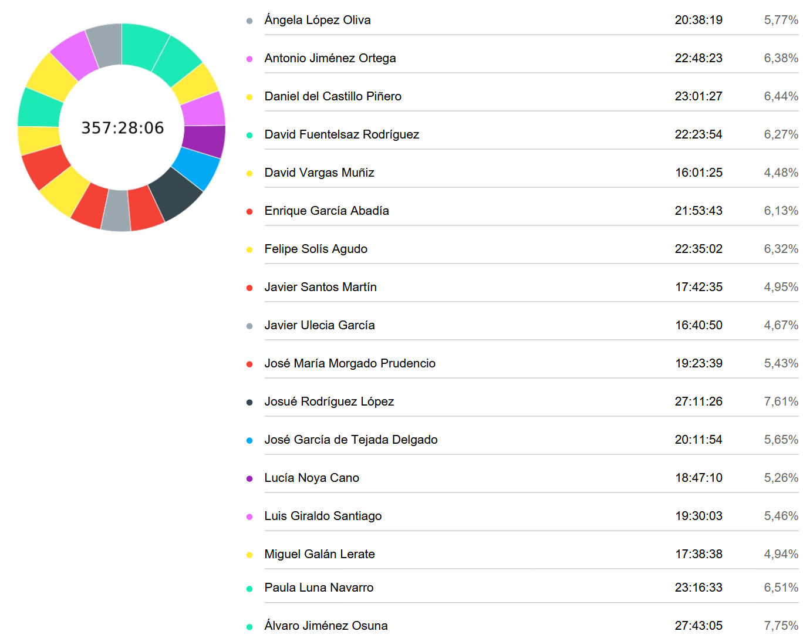

# Time Effort Report

**Fecha:** 30/04/2025  
**Grupo 8:** Infantem  
**Preparing Project Launch**

## Integrantes del Grupo

  

    <ul style="padding-left: 0; list-style: none;">
      <li>Álvaro Jiménez Osuna</li>
      <li>Ángela López Oliva</li>
      <li>Antonio Jiménez Ortega</li>
      <li>Daniel del Castillo Piñero</li>
      <li>David Fuentelsaz Rodríguez</li>
      <li>David Vargas Muñiz</li>
      <li>Enrique García Abadía</li>
      <li>Felipe Solís Agudo</li>
      <li>Javier Santos Martín</li>
    </ul>
  

  

    <ul style="padding-left: 0; list-style: none;">
    <li>Javier Ulecia García</li>
      <li>José García de Tejada Delgado</li>
      <li>Jose Maria Morgado Prudencio</li>
      <li>Josué Rodríguez López López López López López</li>
      <li>Lucía Noya Cano</li>
      <li>Luis Giraldo Santiago</li>
      <li>Miguel Galán Lerate</li>
      <li>Paula Luna Navarro</li>
    </ul>
  

## Colaboradores del documento
- Josué Rodríguez López López López López
  - Creó la versión inicial del documento
---

## Índice
- [Resumen del tiempo invertido por el equipo](#resumen-del-tiempo-invertido-por-el-equipo)
- [Informe detallado de las horas invertidas por cada miembro del equipo](#informe-detallado-de-las-horas-invertidas-por-cada-miembro-del-equipo)
  - [Ángela López Oliva](#ángela-lópez-oliva)
  - [Antonio Jiménez Ortega](#antonio-jiménez-ortega)
  - [Daniel del Castillo Piñero](#daniel-del-castillo-piñero)
  - [David Fuentelsaz Rodríguez](#david-fuentelsaz-rodríguez)
  - [David Vargas Muñiz](#david-vargas-muñiz)
  - [Enrique García Abadía](#enrique-garcía-abadía)
  - [Felipe Solís Agudo](#felipe-solís-agudo)
  - [Javier Santos Martín](#javier-santos-martín)
  - [Javier Ulecia García](#javier-ulecia-garcía)
  - [José María Morgado Prudencio](#jose-maria-morgado-prudencio)
  - [Josué Rodríguez López López López López López](#josué-rodríguez-lópez-lópez)
  - [José García de Tejada Delgado](#josé-garcía-de-tejada-delgado)
  - [Lucía Noya Cano](#lucía-noya-cano)
  - [Luis Giraldo Santiago](#luis-giraldo-santiago)
  - [Miguel Galán Lerate](#miguel-galán-lerate)
  - [Paula Luna Navarro](#paula-luna-navarro)
  - [Álvaro Jiménez Osuna](#álvaro-jiménez-osuna)

## Resumen del tiempo invertido por el equipo

## Informe detallado de las horas invertidas por cada miembro del equipo

#### Ángela López Oliva
| Usuario                       | Tarea                           | Descripción                                                                                                         | Duración (h) |
|-------------------------------|---------------------------------|---------------------------------------------------------------------------------------------------------------------|--------------|
| Ángela López Oliva            |                            | Demo                                                                                                        |     00:27:17 |
| Ángela López Oliva            | Marketing                  | Anuncio                                                                                                     |     00:31:37 |
| Ángela López Oliva            |                            | Demo                                                                                                        |     01:12:27 |
| Ángela López Oliva            |                            | Reunión de presentación                                                                                     |     00:13:34 |
| Ángela López Oliva            | Marketing                  | Anuncio                                                                                                     |     00:45:48 |
| Ángela López Oliva            |                            | Presentación                                                                                                |     00:27:31 |
| Ángela López Oliva            | Asistencia a clase         | Clase                                                                                                       |     01:30:00 |
| Ángela López Oliva            | Marketing                  | Marketing                                                                                                   |     01:39:11 |
| Ángela López Oliva            | Marketing                  | Marketing                                                                                                   |     00:35:10 |
| Ángela López Oliva            | Marketing                  | Anuncio                                                                                                     |     00:42:03 |
| Ángela López Oliva            |                            | Presentación                                                                                                |     00:32:02 |
| Ángela López Oliva            |                            | Presentación                                                                                                |     00:57:34 |
| Ángela López Oliva            | Asistencia a clase         | Clase                                                                                                       |     04:00:00 |
| Ángela López Oliva            | Reuniones                  | Reunión Marketing                                                                                           |     00:21:57 |
| Ángela López Oliva            | Marketing                  | Marketing                                                                                                   |     01:21:19 |
| Ángela López Oliva            |                            | Presentación                                                                                                |     01:02:45 |
| Ángela López Oliva            |                            | Presentación                                                                                                |     00:57:27 |
| Ángela López Oliva            | Código                     | Visual Admin                                                                                                |     00:27:58 |
| Ángela López Oliva            | Marketing                  | Anuncio                                                                                                     |     00:38:06 |
| Ángela López Oliva            | Marketing                  | Anuncio                                                                                                     |     00:39:13 |
| Ángela López Oliva            | Marketing                  | Anuncio                                                                                                     |     00:50:20 |
| Ángela López Oliva            |                            | Demo                                                                                                        |     00:45:00 |
#### Antonio Jiménez Ortega
| Usuario                       | Tarea                           | Descripción                                                                                | Duración (h) |
|-------------------------------|---------------------------------|--------------------------------------------------------------------------------------------|----------------|
|
| Antonio Jiménez Ortega        | Código                     | Arreglar que las recetas de expertos   no puedan ser eliminadas por usuarios normales                       |     00:42:00 |
| Antonio Jiménez Ortega        | Código                     | Arreglar que las recetas de expertos   no puedan ser eliminadas por usuarios normales                       |     00:12:46 |
| Antonio Jiménez Ortega        | Código                     | Arreglar que las recetas de expertos   no puedan ser eliminadas por usuarios normales                       |     00:17:37 |
| Antonio Jiménez Ortega        | Código                     | Mostrar alergenos de los bebés                                                                              |     00:45:47 |
| Antonio Jiménez Ortega        | Código                     | Editar y eliminar recetas                                                                                   |     02:10:00 |
| Antonio Jiménez Ortega        | Código                     | añadir texto al cambiar imagen                                                                              |     00:37:00 |
| Antonio Jiménez Ortega        |                            | Modelo de negocio                                                                                           |     00:10:36 |
| Antonio Jiménez Ortega        | Asistencia a clase         | Review S3                                                                                                   |     03:29:00 |
| Antonio Jiménez Ortega        | Código                     | Arreglar detalles y errores de   alergenos                                                                  |     01:12:18 |
| Antonio Jiménez Ortega        | Código                     | Eliminar imagen                                                                                             |     01:47:15 |
| Antonio Jiménez Ortega        | Código                     | Eliminar imagen                                                                                             |     02:17:12 |
| Antonio Jiménez Ortega        | Código                     | Editar y eliminar recetas                                                                                   |     00:45:18 |
| Antonio Jiménez Ortega        | Documentación              | Grabar video ultimos cambios semana 1   PPL                                                                 |     01:21:57 |
| Antonio Jiménez Ortega        | Código                     | Editar y eliminar recetas                                                                                   |     03:07:59 |
| Antonio Jiménez Ortega        | Código                     | Mostrar alergenos de los bebés                                                                              |     01:37:00 |
| Antonio Jiménez Ortega        | Código                     | Mostrar alergenos de los bebés                                                                              |     01:09:03 |
| Antonio Jiménez Ortega        | Código                     | Mostrar alergenos de los bebés                                                                              |     00:08:50 |
| Antonio Jiménez Ortega        | Documentación              | Pasar Claudette al los terminos y   condiciones                                                             |     00:38:26 |
| Antonio Jiménez Ortega        | Usuario Piloto grupo ajeno | usuario piloto tercera prueba                                                                               |     00:18:19 |

#### Daniel del Castillo Piñero
| Usuario                       | Tarea                           | Descripción                                                                                | Duración (h) |
|-------------------------------|---------------------------------|--------------------------------------------------------------------------------------------|--------------|
| Daniel del Castillo Piñero    | Marketing                  | Grabar anuncio                                                                                              |     00:42:38 |
| Daniel del Castillo Piñero    | Código                     | Grabar demo de la aplicación                                                                                |     00:48:57 |
| Daniel del Castillo Piñero    | Código                     | Corregir eliminar foto de perfil                                                                            |     00:39:37 |
| Daniel del Castillo Piñero    | Documentación              | Elaborar revision.md                                                                                        |     00:11:48 |
| Daniel del Castillo Piñero    | Presentación               | Presentación                                                                                                |     00:35:40 |
| Daniel del Castillo Piñero    | Código                     | Probar tests en la aplicación                                                                               |     00:10:10 |
| Daniel del Castillo Piñero    | Código                     | Comprobación del despliegue ppl                                                                             |     00:39:22 |
| Daniel del Castillo Piñero    | Asistencia a clase         | Clase 25/04 y Recuperación Individual                                                                       |     02:30:00 |
| Daniel del Castillo Piñero    | Código                     | Vista de administrador                                                                                      |     01:13:13 |
| Daniel del Castillo Piñero    | Código                     | Correcciones finales antes de la   entrega y entrega S3                                                     |     05:05:49 |
| Daniel del Castillo Piñero    | Asistencia a clase         | Clase 11/04                                                                                                 |     04:00:00 |
| Daniel del Castillo Piñero    | Reuniones                  | Reunión vocales 09/04                                                                                       |     00:33:31 |
| Daniel del Castillo Piñero    | Código                     | Vista de administrador                                                                                      |     00:10:08 |
| Daniel del Castillo Piñero    | Código                     | Refactorizar y corregir add recipe                                                                          |     01:08:39 |
| Daniel del Castillo Piñero    | Marketing                  | Grabar anuncio                                                                                              |     00:37:00 |
| Daniel del Castillo Piñero    | Documentación              | Revisión de documento de recuperación                                                                       |     00:20:53 |
| Daniel del Castillo Piñero    | Presentación               | Presentación                                                                                                |     01:46:00 |
| Daniel del Castillo Piñero    | Código                     | Arreglo de errores PPL                                                                                      |     00:22:15 |
| Daniel del Castillo Piñero    | Código                     | Arreglar tests                                                                                              |     01:25:47 |

#### David Fuentelsaz Rodríguez
| Usuario                       | Tarea                           | Descripción                                                                                | Duración (h) |
|-------------------------------|---------------------------------|--------------------------------------------------------------------------------------------|--------------|
| David Fuentelsaz Rodríguez    | Documentación              | Documento lecciones aprendidas sprint   2                                                                   |     02:02:00 |
| David Fuentelsaz Rodríguez    | Documentación              | Documento lecciones aprendidas sprint   2                                                                   |     01:00:49 |
| David Fuentelsaz Rodríguez    | Documentación              | Documento lecciones aprendidas sprint   2                                                                   |     01:20:29 |
| David Fuentelsaz Rodríguez    |                            | Probar aplicación                                                                                           |     01:57:08 |
| David Fuentelsaz Rodríguez    |                            | Probar aplicación                                                                                           |     00:55:19 |
| David Fuentelsaz Rodríguez    |                            | Arreglar bugs                                                                                               |     02:07:11 |
| David Fuentelsaz Rodríguez    | Documentación              | Documento lecciones aprendidas sprint   2                                                                   |     01:00:00 |
| David Fuentelsaz Rodríguez    | Código                     | Validación formulario de edición de   perfil                                                                |     00:45:37 |
| David Fuentelsaz Rodríguez    |                            | Clase 25/04                                                                                                 |     04:00:00 |
| David Fuentelsaz Rodríguez    | Documentación              | Documento lecciones aprendidas sprint   2                                                                   |     00:40:00 |
| David Fuentelsaz Rodríguez    | Asistencia a clase         | Clase 11/04                                                                                                 |     04:00:00 |
| David Fuentelsaz Rodríguez    | Reuniones                  | Reunión vocales 14/04                                                                                       |     00:18:25 |
| David Fuentelsaz Rodríguez    | Documentación              | Documento lecciones aprendidas sprint   2                                                                   |     00:55:22 |
| David Fuentelsaz Rodríguez    | Documentación              | Documento lecciones aprendidas sprint   2                                                                   |     01:00:00 |
| David Fuentelsaz Rodríguez    |                            | Arreglar bugs                                                                                               |     00:21:34 |
#### David Vargas Muñiz
| Usuario                       | Tarea                           | Descripción                                                                                | Duración (h) |
|-------------------------------|---------------------------------|--------------------------------------------------------------------------------------------|--------------|
| David Vargas Muñiz            | Presentación               | Preparar presentación 02/05/2025                                                                            |     00:14:02 |
| David Vargas Muñiz            | Presentación               | Preparar presentación 02/05/2025                                                                            |     00:29:16 |
| David Vargas Muñiz            | Presentación               | Preparar presentación 02/05/2025                                                                            |     00:26:50 |
| David Vargas Muñiz            | Asistencia a clase         | Clase 25/04/2025                                                                                            |     04:30:00 |
| David Vargas Muñiz            | Asistencia a clase         | Clase 11/04/2025                                                                                            |     03:30:00 |
| David Vargas Muñiz            | Presentación               | Preparar presentación 24/04/2025                                                                            |     02:17:52 |
| David Vargas Muñiz            | Presentación               | Preparar presentación 24/04/2025                                                                            |     00:24:38 |
| David Vargas Muñiz            | Presentación               | Preparar presentación 02/05/2025                                                                            |     00:30:40 |
| David Vargas Muñiz            | Presentación               | Preparar presentación 02/05/2025                                                                            |     00:52:14 |
| David Vargas Muñiz            | Presentación               | Preparar presentación 02/05/2025                                                                            |     00:39:44 |
| David Vargas Muñiz            |                            | Píldora teórica ISPP 2024   (Segmentación, Tracción y Comm Mngmt) (52:28)                                   |     00:00:49 |
| David Vargas Muñiz            |                            | Píldora teórica ISPP 2024   (Segmentación, Tracción y Comm Mngmt) (52:28)                                   |     00:45:17 |
| David Vargas Muñiz            |                            | Píldora teórica ISPP 2024   (Segmentación, Tracción y Comm Mngmt) (52:28)                                   |     00:06:40 |
| David Vargas Muñiz            | Presentación               | Preparar presentación 02/05/2025                                                                            |     01:13:23 |
#### Enrique García Abadía
| Usuario                       | Tarea                           | Descripción                                                                                | Duración (h) |
|-------------------------------|---------------------------------|--------------------------------------------------------------------------------------------|--------------|
| Enrique García Abadía         | Código                     | #414 Finalización Calendario                                                                                |     02:20:00 |
| Enrique García Abadía         | Documentación              | Lessons Learned S1                                                                                          |     00:37:43 |
| Enrique García Abadía         | Documentación              | Lessons Learned S1                                                                                          |     02:18:52 |
| Enrique García Abadía         | Documentación              | Lessons Learned S1                                                                                          |     01:21:00 |
| Enrique García Abadía         | Código                     | #414 Finalización Calendario                                                                                |     03:44:52 |
| Enrique García Abadía         | Código                     | #414 Finalización Calendario                                                                                |     02:49:00 |
| Enrique García Abadía         | Asistencia a clase         | Clase día 11/04                                                                                             |     04:00:00 |
| Enrique García Abadía         | Código                     | Revisión de frontend pre-presentación                                                                       |     01:02:00 |
| Enrique García Abadía         | Documentación              | Lessons Learned S1                                                                                          |     02:23:16 |
| Enrique García Abadía         | Código                     | #414 Finalización Calendario                                                                                |     01:17:00 |
#### Felipe Solís Agudo
| Usuario                       | Tarea                           | Descripción                                                                                | Duración (h) |
|-------------------------------|---------------------------------|--------------------------------------------------------------------------------------------|--------------|
| Felipe Solís Agudo            | Documentación              | Revisión documentación entrega PPL                                                                          |     00:23:26 |
| Felipe Solís Agudo            | Código                     | Testeando editar y eliminar imagenes   en recetas                                                           |     00:08:59 |
| Felipe Solís Agudo            | Píldoras teóricas          | Píldora teórica ISPP 2024   (Segmentación, Tracción y Comm Mngmt) (52:28)                                   |     00:52:37 |
| Felipe Solís Agudo            | Documentación              | Pasar a limpio feedback Grupo 7   MapYourWorld                                                              |     00:02:27 |
| Felipe Solís Agudo            | Código                     | Eliminar anuncio allergen si   autoridad user = premium                                                     |     00:25:44 |
| Felipe Solís Agudo            | Código                     | Revisión Edit recetas                                                                                       |     00:05:02 |
| Felipe Solís Agudo            | Código                     | Comprobando validaciones frontend                                                                           |     00:23:14 |
| Felipe Solís Agudo            | Código                     | Probar funcionamiento de crear,   editar y eliminar recetas (problemas con todo lo relacionado con la foto) |     00:16:52 |
| Felipe Solís Agudo            | Presentación               | Revisión presentación 25/04/2025                                                                            |     00:15:00 |
| Felipe Solís Agudo            | Código                     | Test Selenium Create Baby y Edit Baby                                                                       |     00:44:16 |
| Felipe Solís Agudo            | Documentación              | Encuesta actividad individual extra                                                                         |     00:01:35 |
| Felipe Solís Agudo            | Reuniones                  | Reunión PPL marketing y documentación                                                                       |     00:33:32 |
| Felipe Solís Agudo            | Asistencia a clase         | Clase 11/04/2925 evaluación S3                                                                              |     04:00:00 |
| Felipe Solís Agudo            | Reuniones                  | Gestión S3 final                                                                                            |     02:53:34 |
| Felipe Solís Agudo            | Reuniones                  | Preparación entrega S3                                                                                      |     01:12:54 |
| Felipe Solís Agudo            | Reuniones                  | Reunión inicio PPL a nivel de código                                                                        |     00:18:41 |
| Felipe Solís Agudo            | Código                     | Update on the SeleniumTestLogInLogOut   and Failure                                                         |     00:31:12 |
| Felipe Solís Agudo            | Código                     | Register and RegisterFailure Selenium   Tests                                                               |     00:18:27 |
| Felipe Solís Agudo            | Documentación              | Actualización y redacción feedback   grupos sesión 11/04/2025                                               |     00:13:16 |
| Felipe Solís Agudo            | Código                     | Actualización y adición validaciones   crear recetas                                                        |     00:16:02 |
| Felipe Solís Agudo            | Documentación              | Repaso docs LessonLearnedS1 y S2                                                                            |     00:09:19 |
| Felipe Solís Agudo            | Asistencia a clase         | Clase 25/04/2025 + 30 minutos sesión   punto extra                                                          |     04:30:00 |
| Felipe Solís Agudo            | Código                     | Test Baby Selenium                                                                                          |     00:26:51 |
| Felipe Solís Agudo            | Código                     | Revisión PR #413                                                                                            |     00:07:56 |
| Felipe Solís Agudo            | Documentación              | Pasar a limpio feedback KBreport                                                                            |     00:09:41 |
| Felipe Solís Agudo            | Código                     | Validaciones recetas                                                                                        |     00:31:45 |
| Felipe Solís Agudo            | Código                     | Revisión PR #424                                                                                            |     00:18:15 |
| Felipe Solís Agudo            | Código                     | Revisión PR #426                                                                                            |     00:04:40 |
| Felipe Solís Agudo            | Código                     | Revisión PR #424, correcciones y   adición de validaciones, probando funcionalidad completa calendario      |     01:09:26 |
| Felipe Solís Agudo            | Código                     | Calendar vaccine and intake Selenium   test                                                                 |     00:43:42 |
| Felipe Solís Agudo            | Código                     | Arreglo validaciones baby                                                                                   |     00:26:37 |
#### Javier Santos Martín
| Usuario                       | Tarea                           | Descripción                                                                                | Duración (h) |
|-------------------------------|---------------------------------|--------------------------------------------------------------------------------------------|--------------|
| Javier Santos Martín          | Código                     | Implementando recetas personalizadas                                                                        |     02:09:36 |
| Javier Santos Martín          | Código                     | Implementando recetas personalizadas   y arreglo de errores                                                 |     01:27:06 |
| Javier Santos Martín          | Código                     | Implementando recetas personalizadas                                                                        |     01:19:12 |
| Javier Santos Martín          | Asistencia a clase         | Clase 04/04                                                                                                 |     04:00:00 |
| Javier Santos Martín          | Código                     | Implementando recetas personalizadas                                                                        |     01:31:01 |
| Javier Santos Martín          | Código                     | Implementando recetas personalizadas                                                                        |     02:51:19 |
| Javier Santos Martín          | Código                     | Implementando recetas personalizadas                                                                        |     01:01:07 |
| Javier Santos Martín          |                            | Reunión + trabajo de útmo día                                                                               |     02:50:12 |
| Javier Santos Martín          | Código                     | DTO disease                                                                                                 |     00:33:02 |
#### Javier Ulecia García
| Usuario                       | Tarea                           | Descripción                                                                                | Duración (h) |
|-------------------------------|---------------------------------|--------------------------------------------------------------------------------------------|--------------|
| Javier Ulecia García          |                            | Probar aplicacion                                                                                           |     00:47:22 |
| Javier Ulecia García          | Documentación              | Posicionamiento SEO #389                                                                                    |     01:37:06 |
| Javier Ulecia García          | Documentación              | Recuperacion de los sprint                                                                                  |     00:11:22 |
| Javier Ulecia García          | Asistencia a clase         | Clase 11/04/25                                                                                              |     04:00:00 |
| Javier Ulecia García          | Documentación              | Posicionamiento SEO #389                                                                                    |     02:25:02 |
| Javier Ulecia García          | Asistencia a clase         | Clase 25/04/25 + Actividad extra                                                                            |     04:30:00 |
| Javier Ulecia García          |                            | Probar aplicacion                                                                                           |     00:59:03 |
| Javier Ulecia García          | Usuario Piloto grupo ajeno | Usuario piloto fisiofind                                                                                    |     00:16:20 |
| Javier Ulecia García          |                            | probar frontend                                                                                             |     00:54:35 |
| Javier Ulecia García          |                            | Ver pildoras teoricas                                                                                       |     01:00:00 |
#### José María Morgado Prudencio
| Usuario                       | Tarea                           | Descripción                                                                                | Duración (h) |
|-------------------------------|---------------------------------|--------------------------------------------------------------------------------------------|--------------|
| José María Morgado Prudencio                 | Documentación              | datos de fuentes fiables                                                                                    |     00:52:55 |
| José María Morgado Prudencio                 | Usuario Piloto grupo ajeno | Usuario Piloto G5                                                                                           |     00:50:09 |
| José María Morgado Prudencio                 | Documentación              | modelo de segmentacion Marketing                                                                            |     01:39:10 |
| José María Morgado Prudencio                 |                            | visualizacion de pildoras teoricas                                                                          |     01:46:23 |
| José María Morgado Prudencio                 | Asistencia a clase         | Asistencia a Clase                                                                                          |     04:00:00 |
| José María Morgado Prudencio                 | Documentación              | Actualizar analisis de costes                                                                               |     01:16:17 |
| José María Morgado Prudencio                 |                            | Intentar romper la app                                                                                      |     01:12:01 |
| José María Morgado Prudencio                 | Documentación              | Actualizar analisis de costes                                                                               |     04:07:26 |
| José María Morgado Prudencio                 | Documentación              | Actualizar analisis de costes                                                                               |     03:39:18 |
#### Josué Rodríguez López
| Usuario                       | Tarea                           | Descripción                                                                                | Duración (h) |
|-------------------------------|---------------------------------|--------------------------------------------------------------------------------------------|--------------|
| Josué Rodríguez López               | Revisión de Pull Requests  | Revisión de pull requests                                                                                   |     00:08:30 |
| Josué Rodríguez López               | Código                     | Creación de recetas personalizadas                                                                          |     01:14:10 |
| Josué Rodríguez López               |                            | timeEffortReport                                                                                            |     00:27:05 |
| Josué Rodríguez López               | Código                     | Errores de imágenes                                                                                         |     02:38:15 |
| Josué Rodríguez López               | Asistencia a clase         | Asistencia a clase                                                                                          |     04:00:00 |
| Josué Rodríguez López               | Reuniones                  | Reunión de inicio de Sprint                                                                                 |     00:18:00 |
| Josué Rodríguez López               | Reuniones                  | Reunión de inicio de Sprint                                                                                 |     00:08:29 |
| Josué Rodríguez López               | Código                     | Creación de recetas personalizadas                                                                          |     00:15:17 |
| Josué Rodríguez López               | Código                     | Creación de recetas personalizadas                                                                          |     00:58:56 |
| Josué Rodríguez López               | Revisión de Pull Requests  | Revisión de pull request                                                                                    |     00:07:41 |
| Josué Rodríguez López               | Documentación              | Documento de costes                                                                                         |     03:52:22 |
| Josué Rodríguez López               | Revisión de Pull Requests  | Revisión de pull request                                                                                    |     00:59:32 |
| Josué Rodríguez López               | Usuario Piloto grupo ajeno | Feedback de usuario piloto del G4                                                                           |     00:16:33 |
| Josué Rodríguez López               | Documentación              | Documento de costes                                                                                         |     00:40:49 |
| Josué Rodríguez López               | Documentación              | Documento de costes                                                                                         |     01:13:11 |
| Josué Rodríguez López               | Código                     | Tests de recetas personalizadas                                                                             |     00:51:36 |
| Josué Rodríguez López               | Documentación              | Revisión de los reportes de   recuperación de nota                                                          |     00:49:31 |
| Josué Rodríguez López               | Documentación              | Revisión de los reportes de   recuperación de nota                                                          |     00:07:47 |
| Josué Rodríguez López               | Documentación              | Revisión de los reportes de   recuperación de nota                                                          |     00:26:30 |
| Josué Rodríguez López               | Código                     | Creación de recetas personalizadas                                                                          |     00:24:59 |
| Josué Rodríguez López               | Código                     | Creación de recetas personalizadas                                                                          |     00:19:17 |
| Josué Rodríguez López               | Código                     | Creación de recetas personalizadas                                                                          |     01:28:18 |
| Josué Rodríguez López               | Usuario Piloto grupo ajeno | Feedback de usuario piloto del G4                                                                           |     01:18:55 |
| Josué Rodríguez López               | Código                     | Creación de recetas personalizadas                                                                          |     00:34:48 |
| Josué Rodríguez López               | Código                     | Creación de recetas personalizadas                                                                          |     00:13:14 |
| Josué Rodríguez López               | Asistencia a clase         | Actividad subida de nota individual                                                                         |     00:30:00 |
| Josué Rodríguez López               | Código                     | Creación de recetas personalizadas                                                                          |     00:16:11 |
| Josué Rodríguez López               | Código                     | Creación de recetas personalizadas                                                                          |     02:21:53 |
| Josué Rodríguez López               | Documentación              | Performance evaluation                                                                                      |     00:09:37 |
#### José García de Tejada Delgado
| Usuario                       | Tarea                           | Descripción                                                                                | Duración (h) |
|-------------------------------|---------------------------------|--------------------------------------------------------------------------------------------|--------------|
| José García de Tejada Delgado |                            | testing admin                                                                                               |     01:07:42 |
| José García de Tejada Delgado |                            | fix metrics bug                                                                                             |     00:19:28 |
| José García de Tejada Delgado |                            | send role to frontend                                                                                       |     00:10:18 |
| José García de Tejada Delgado |                            | fix recipes bug                                                                                             |     01:14:16 |
| José García de Tejada Delgado |                            | fixing recipes tests                                                                                        |     00:39:38 |
| José García de Tejada Delgado |                            | customized requests testing                                                                                 |     00:25:01 |
| José García de Tejada Delgado |                            | clase                                                                                                       |     00:30:00 |
| José García de Tejada Delgado |                            | testing                                                                                                     |     04:07:28 |
| José García de Tejada Delgado |                            | fix                                                                                                         |     00:09:50 |
| José García de Tejada Delgado |                            | testing                                                                                                     |     01:59:38 |
| José García de Tejada Delgado |                            | testing                                                                                                     |     02:00:20 |
| José García de Tejada Delgado |                            | testing                                                                                                     |     00:40:43 |
| José García de Tejada Delgado |                            | testing                                                                                                     |     00:31:45 |
| José García de Tejada Delgado |                            | fix                                                                                                         |     00:27:12 |
| José García de Tejada Delgado | Asistencia a clase         | clase 11 abril                                                                                              |     04:00:00 |
| José García de Tejada Delgado |                            | arreglando a ultima hora                                                                                    |     01:12:43 |
| José García de Tejada Delgado |                            | testing                                                                                                     |     00:35:52 |
#### Lucía Noya Cano
| Usuario                       | Tarea                           | Descripción                                                                                | Duración (h) |
|-------------------------------|---------------------------------|--------------------------------------------------------------------------------------------|--------------|
| Lucía Noya Cano               | Marketing                  | Crear carteles para marketing                                                                               |     00:38:58 |
| Lucía Noya Cano               | Marketing                  | Crear carteles para marketing                                                                               |     00:31:55 |
| Lucía Noya Cano               | Marketing                  | Crear carteles para marketing                                                                               |     00:34:36 |
| Lucía Noya Cano               | Marketing                  | Crear carteles para marketing                                                                               |     01:28:26 |
| Lucía Noya Cano               | Asistencia a clase         |                                                                                                             |     03:18:46 |
| Lucía Noya Cano               | Documentación              | Community management                                                                                        |     00:50:44 |
| Lucía Noya Cano               | Marketing                  | Crear carteles para marketing                                                                               |     01:41:24 |
| Lucía Noya Cano               | Documentación              | Encuesta feedback UP                                                                                        |     00:00:06 |
| Lucía Noya Cano               | Marketing                  | Subir contenido a redes                                                                                     |     00:36:00 |
| Lucía Noya Cano               | Marketing                  | Subir contenido a redes                                                                                     |     01:26:06 |
| Lucía Noya Cano               | Documentación              | Encuesta feedback UP                                                                                        |     01:10:00 |
| Lucía Noya Cano               | Documentación              | Encuesta feedback UP                                                                                        |     00:02:39 |
| Lucía Noya Cano               | Marketing                  | Subir contenido a redes                                                                                     |     00:44:11 |
| Lucía Noya Cano               | Asistencia a clase         |                                                                                                             |     00:11:11 |
| Lucía Noya Cano               | Marketing                  | Subir contenido a redes                                                                                     |     01:42:00 |
| Lucía Noya Cano               | Documentación              | Community management                                                                                        |     01:04:14 |
| Lucía Noya Cano               | Marketing                  | Crear carteles para marketing                                                                               |     00:31:49 |
| Lucía Noya Cano               | Marketing                  | Subir contenido a redes                                                                                     |     00:15:03 |
| Lucía Noya Cano               | Píldoras teóricas          | Píldoras teóricas                                                                                           |     00:53:31 |
| Lucía Noya Cano               | Marketing                  | Crear carteles para marketing                                                                               |     00:08:41 |
| Lucía Noya Cano               | Marketing                  | Crear carteles para marketing                                                                               |     00:24:41 |
| Lucía Noya Cano               | Documentación              | Community management                                                                                        |     00:32:09 |
#### Luis Giraldo Santiago
| Usuario                       | Tarea                           | Descripción                                                                                | Duración (h) |
|-------------------------------|---------------------------------|--------------------------------------------------------------------------------------------|--------------|
| Luis Giraldo Santiago         | Píldoras teóricas          | Píldoras 8 y 9                                                                                              |     00:42:03 |
| Luis Giraldo Santiago         | Código                     | Método de pago                                                                                              |     05:00:00 |
| Luis Giraldo Santiago         | Asistencia a clase         | Clase 25/04                                                                                                 |     04:00:00 |
| Luis Giraldo Santiago         | Código                     | Método de pago                                                                                              |     03:00:00 |
| Luis Giraldo Santiago         | Reuniones                  | Reunión 14/04                                                                                               |     00:18:00 |
| Luis Giraldo Santiago         | Asistencia a clase         | Clase 11/04                                                                                                 |     03:30:00 |
| Luis Giraldo Santiago         | Código                     | Testeo y arreglos de bug                                                                                    |     03:00:00 |
#### Miguel Galán Lerate
| Usuario                       | Tarea                           | Descripción                                                                                | Duración (h) |
|-------------------------------|---------------------------------|--------------------------------------------------------------------------------------------|--------------|
| Miguel Galán Lerate           |                            | Asistencia a clase                                                                                          |     04:00:00 |
| Miguel Galán Lerate           |                            | Arreglo de workflow de test                                                                                 |     00:28:17 |
| Miguel Galán Lerate           |                            | Arreglo de workflow de test                                                                                 |     00:45:32 |
| Miguel Galán Lerate           |                            | Arreglo de workflow de test                                                                                 |     00:40:11 |
| Miguel Galán Lerate           |                            | Redespliegue S1                                                                                             |     01:00:00 |
| Miguel Galán Lerate           |                            | Asistencia a clase                                                                                          |     04:00:00 |
| Miguel Galán Lerate           |                            | Arreglo de workflow de test                                                                                 |     00:16:55 |
| Miguel Galán Lerate           |                            | Arreglar linter                                                                                             |     00:08:06 |
| Miguel Galán Lerate           |                            | Arreglo de workflow de test                                                                                 |     00:17:16 |
| Miguel Galán Lerate           |                            | Despliegue PPL                                                                                              |     03:25:38 |
| Miguel Galán Lerate           |                            | Despliegue PPL                                                                                              |     01:36:43 |
| Miguel Galán Lerate           |                            | Arreglo de tests                                                                                            |     01:00:00 |
#### Paula Luna Navarro
| Usuario                       | Tarea                           | Descripción                                                                                | Duración (h) |
|-------------------------------|---------------------------------|--------------------------------------------------------------------------------------------|--------------|
| Paula Luna Navarro            |                            | pilotUserPerformanceEvaluation.md PPL   + preparación doc para la entrega                                   |     01:15:11 |
| Paula Luna Navarro            | Documentación              | Costes para PPL presentación                                                                                |     01:12:50 |
| Paula Luna Navarro            | Presentación               | Revisión y modificación presentación                                                                        |     00:25:00 |
| Paula Luna Navarro            | Usuarios Piloto            | Feedback UP (recogiendo y   categorizando feedback de esta semana)                                          |     00:42:24 |
| Paula Luna Navarro            | Marketing                  | Integración + revisión público   objetivo y protopersonas en el doc de marketing                            |     00:29:44 |
| Paula Luna Navarro            | Documentación              | Modelo de negocio, Plan de negocio   #387 para la presentación                                              |     00:36:00 |
| Paula Luna Navarro            | Marketing                  | Uso de IA para Marketing #393                                                                               |     00:13:25 |
| Paula Luna Navarro            | Marketing                  | Integración SEO positioning en el   documento de marketing + revisión                                       |     00:43:34 |
| Paula Luna Navarro            | Marketing                  | Reunión marketing 16/04                                                                                     |     00:22:42 |
| Paula Luna Navarro            |                            | Reunión vocales 15/04 organización   PPL                                                                    |     00:33:00 |
| Paula Luna Navarro            | Documentación              | Revisión final entrega docs                                                                                 |     00:27:00 |
| Paula Luna Navarro            | Reuniones                  | Reunión Vocales final S3                                                                                    |     01:47:00 |
| Paula Luna Navarro            | Asistencia a clase         | Asistencia a clase 11/04/2025                                                                               |     04:00:53 |
| Paula Luna Navarro            | Documentación              | Planificación tareas marketing y   documentación                                                            |     00:38:54 |
| Paula Luna Navarro            | Documentación              | Revisión documentación                                                                                      |     00:55:30 |
| Paula Luna Navarro            | Marketing                  | Integración SEO positioning en el   documento de marketing + revisión                                       |     00:19:20 |
| Paula Luna Navarro            | Marketing                  | Uso de IA para Marketing #393                                                                               |     00:23:12 |
| Paula Luna Navarro            | Documentación              | Modelo de negocio, Plan de negocio   #387 para la presentación                                              |     00:44:01 |
| Paula Luna Navarro            | Usuarios Piloto            | Feedback UP (recogiendo y   categorizando feedback de esta semana)                                          |     00:43:35 |
| Paula Luna Navarro            | Documentación              | Revisión Documento de lecciones   aprendidas #395                                                           |     00:10:29 |
| Paula Luna Navarro            | Asistencia a clase         | asistencia a clase 25/04/2025 + 30min   punto extra                                                         |     04:30:00 |
| Paula Luna Navarro            | Documentación              | Costes para PPL presentación                                                                                |     00:33:28 |
| Paula Luna Navarro            | Marketing                  | Integración doc CM en planificación   de marketing + revisión                                               |     00:36:09 |
| Paula Luna Navarro            | Píldoras teóricas          | Visualización de Píldoras teóricas                                                                          |     00:53:12 |
#### Álvaro Jiménez Osuna
| Usuario                       | Tarea                           | Descripción                                                                                | Duración (h) |
|-------------------------------|---------------------------------|--------------------------------------------------------------------------------------------|--------------|
| Álvaro Jiménez Osuna          | Presentación               | Presentación                                                                                                |     00:42:54 |
| Álvaro Jiménez Osuna          | Marketing                  | Marketing: Anuncio Cliente e   Inversores                                                                   |     00:37:02 |
| Álvaro Jiménez Osuna          | Marketing                  | Diseño instagram                                                                                            |     01:03:01 |
| Álvaro Jiménez Osuna          | Marketing                  | Marketing: Filtro Tiktok                                                                                    |     03:05:04 |
| Álvaro Jiménez Osuna          | Marketing                  | Reunión Marketing                                                                                           |     00:21:16 |
| Álvaro Jiménez Osuna          | Reuniones                  | Reunión Vocales                                                                                             |     00:36:10 |
| Álvaro Jiménez Osuna          | Asistencia a clase         | Clase 11/04                                                                                                 |     04:00:00 |
| Álvaro Jiménez Osuna          | Reuniones                  | Reunion Notas Esfuerzo Sprint 3                                                                             |     00:19:36 |
| Álvaro Jiménez Osuna          | Presentación               | Gráficas presentación                                                                                       |     00:28:28 |
| Álvaro Jiménez Osuna          | Marketing                  | Marketing: investigación                                                                                    |     00:42:34 |
| Álvaro Jiménez Osuna          | Marketing                  | Diseño Carteles                                                                                             |     00:20:34 |
| Álvaro Jiménez Osuna          | Marketing                  | Diseño Enara                                                                                                |     01:04:00 |
| Álvaro Jiménez Osuna          | Marketing                  | Diseño Instagram                                                                                            |     01:12:44 |
| Álvaro Jiménez Osuna          | Presentación               | Presentación                                                                                                |     01:46:04 |
| Álvaro Jiménez Osuna          | Asistencia a clase         | Clase 25/04                                                                                                 |     02:30:00 |
| Álvaro Jiménez Osuna          | Presentación               | Presentación                                                                                                |     00:53:55 |
| Álvaro Jiménez Osuna          | Presentación               | Presentación                                                                                                |     00:54:25 |
| Álvaro Jiménez Osuna          | Presentación               | Presentación                                                                                                |     01:26:56 |
| Álvaro Jiménez Osuna          | Presentación               | Presentación                                                                                                |     01:20:40 |
| Álvaro Jiménez Osuna          | Presentación               | Presentación                                                                                                |     00:26:13 |
| Álvaro Jiménez Osuna          | Presentación               | Video Demo                                                                                                  |     00:27:12 |
| Álvaro Jiménez Osuna          | Presentación               | Video Anuncio                                                                                               |     00:42:00 |
| Álvaro Jiménez Osuna          | Marketing                  | Diseño Carteles                                                                                             |     00:29:35 |
| Álvaro Jiménez Osuna          | Presentación               | Gráficas presentación                                                                                       |     00:33:36 |
| Álvaro Jiménez Osuna          | Presentación               | Video Demo                                                                                                  |     00:20:07 |
| Álvaro Jiménez Osuna          | Presentación               | Reunión Presentación                                                                                        |     00:18:00 |
| Álvaro Jiménez Osuna          | Presentación               | Video Demo                                                                                                  |     00:26:02 |
| Álvaro Jiménez Osuna          | Presentación               | Gráfica Costes                                                                                              |     00:34:57 |