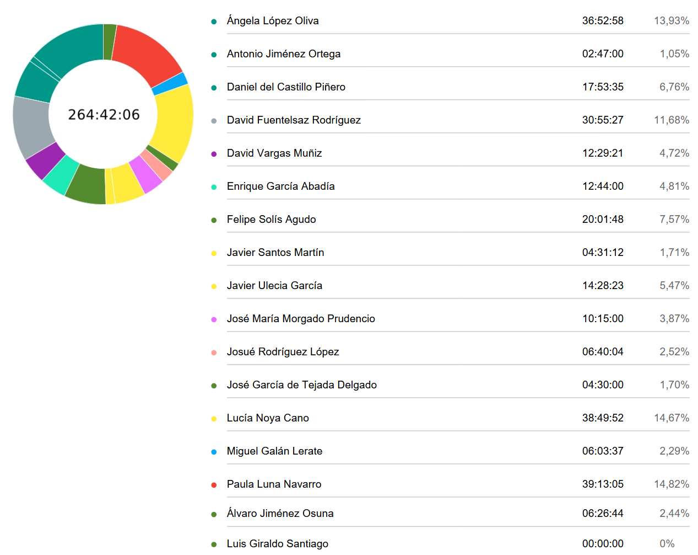

# Time Effort Report

**Fecha:** 15/05/2025  
**Grupo 8:** Infantem  
**World Project Launch**

## Integrantes del Grupo

  

    <ul style="padding-left: 0; list-style: none;">
      <li>Álvaro Jiménez Osuna</li>
      <li>Ángela López Oliva</li>
      <li>Antonio Jiménez Ortega</li>
      <li>Daniel del Castillo Piñero</li>
      <li>David Fuentelsaz Rodríguez</li>
      <li>David Vargas Muñiz</li>
      <li>Enrique García Abadía</li>
      <li>Felipe Solís Agudo</li>
      <li>Javier Santos Martín</li>
    </ul>
  

  

    <ul style="padding-left: 0; list-style: none;">
    <li>Javier Ulecia García</li>
      <li>José García de Tejada Delgado</li>
      <li>Jose Maria Morgado Prudencio</li>
      <li>Josué Rodríguez López López López López López López</li>
      <li>Lucía Noya Cano</li>
      <li>Luis Giraldo Santiago</li>
      <li>Miguel Galán Lerate</li>
      <li>Paula Luna Navarro</li>
    </ul>
  

## Colaboradores del documento
- Josué Rodríguez López
  - Creó la versión inicial del documento
---

## Índice
- [Resumen del tiempo invertido por el equipo](#resumen-del-tiempo-invertido-por-el-equipo)
- [Informe detallado de las horas invertidas por cada miembro del equipo](#informe-detallado-de-las-horas-invertidas-por-cada-miembro-del-equipo)
  - [Ángela López Oliva](#ángela-lópez-oliva)
  - [Antonio Jiménez Ortega](#antonio-jiménez-ortega)
  - [Daniel del Castillo Piñero](#daniel-del-castillo-piñero)
  - [David Fuentelsaz Rodríguez](#david-fuentelsaz-rodríguez)
  - [David Vargas Muñiz](#david-vargas-muñiz)
  - [Enrique García Abadía](#enrique-garcía-abadía)
  - [Felipe Solís Agudo](#felipe-solís-agudo)
  - [Javier Santos Martín](#javier-santos-martín)
  - [Javier Ulecia García](#javier-ulecia-garcía)
  - [José María Morgado Prudencio](#jose-maria-morgado-prudencio)
  - [Josué Rodríguez López](#josué-rodríguez-lópez)
  - [José García de Tejada Delgado](#josé-garcía-de-tejada-delgado)
  - [Lucía Noya Cano](#lucía-noya-cano)
  - [Luis Giraldo Santiago](#luis-giraldo-santiago)
  - [Miguel Galán Lerate](#miguel-galán-lerate)
  - [Paula Luna Navarro](#paula-luna-navarro)
  - [Álvaro Jiménez Osuna](#álvaro-jiménez-osuna)

## Resumen del tiempo invertido por el equipo

## Informe detallado de las horas invertidas por cada miembro del equipo

#### Ángela López Oliva
| Usuario                       | Tarea                           | Descripción                                                                                                         | Duración (h) |
|-------------------------------|---------------------------------|---------------------------------------------------------------------------------------------------------------------|--------------|
| Ángela López Oliva            |                    | Stand                                                                                                                                            |     00:31:26 |
| Ángela López Oliva            |                    | terminar disfraz + crear contenido   redes                                                                                                       |     03:03:23 |
| Ángela López Oliva            |                    | Presentación                                                                                                                                     |     01:17:15 |
| Ángela López Oliva            |                    | Reunión revisión presentación                                                                                                                    |     00:00:02 |
| Ángela López Oliva            | Asistencia a clase | Clase                                                                                                                                            |     00:35:00 |
| Ángela López Oliva            |                    | Presentación                                                                                                                                     |     01:07:33 |
| Ángela López Oliva            |                    | Demo                                                                                                                                             |     01:16:21 |
| Ángela López Oliva            |                    | Presentación                                                                                                                                     |     02:53:03 |
| Ángela López Oliva            |                    | Disfraz Sponny                                                                                                                                   |     05:30:17 |
| Ángela López Oliva            |                    | Gráficas                                                                                                                                         |     00:50:16 |
| Ángela López Oliva            |                    | Presentación                                                                                                                                     |     00:55:31 |
| Ángela López Oliva            |                    | Marketing (IA de voz)                                                                                                                            |     01:34:59 |
| Ángela López Oliva            |                    | Marketing (Folleto)                                                                                                                              |     01:10:20 |
| Ángela López Oliva            |                    | Demo                                                                                                                                             |     01:25:43 |
| Ángela López Oliva            |                    | Presentación                                                                                                                                     |     00:57:44 |
| Ángela López Oliva            |                    | Slides 1,2,3 y 4                                                                                                                                 |     00:54:36 |
| Ángela López Oliva            |                    | Slide                                                                                                                                            |     00:20:41 |
| Ángela López Oliva            |                    | Presentación                                                                                                                                     |     00:51:06 |
| Ángela López Oliva            |                    | Presentación                                                                                                                                     |     01:04:08 |
| Ángela López Oliva            |                    | Formularios                                                                                                                                      |     00:53:23 |
| Ángela López Oliva            |                    | Formularios                                                                                                                                      |     00:53:02 |
| Ángela López Oliva            |                    | Presentación                                                                                                                                     |     01:24:16 |
| Ángela López Oliva            |                    | Presentación                                                                                                                                     |     00:34:58 |
| Ángela López Oliva            | Reunión            | Disfraz                                                                                                                                          |     00:31:00 |
| Ángela López Oliva            | Asistencia a clase | Clase                                                                                                                                            |     03:30:00 |
| Ángela López Oliva            |                    | Presentación                                                                                                                                     |     00:43:05 |
| Ángela López Oliva            |                    | Marketing                                                                                                                                        |     00:26:32 |
| Ángela López Oliva            |                    | Colgar carteles                                                                                                                                  |     00:30:00 |
| Ángela López Oliva            |                    | Team-Building                                                                                                                                    |     01:00:00 |
| Ángela López Oliva            |                    | Performance Evaluation                                                                                                                           |     00:07:18 |

#### Antonio Jiménez Ortega
| Usuario                       | Tarea                           | Descripción                                                                                | Duración (h) |
|-------------------------------|---------------------------------|--------------------------------------------------------------------------------------------|----------------|
|Antonio Jiménez Ortega        | Asistencia a clase | Review PPL                                                                                                                                       |     02:47:00 |

#### Daniel del Castillo Piñero
| Usuario                       | Tarea                           | Descripción                                                                                | Duración (h) |
|-------------------------------|---------------------------------|--------------------------------------------------------------------------------------------|--------------|
| Daniel del Castillo Piñero    | Documentación      | Rellenar performanceEvaluation.md                                                                                                                |     00:08:12 |
| Daniel del Castillo Piñero    | Marketing          | Stand presentación final                                                                                                                         |     01:11:32 |
| Daniel del Castillo Piñero    | Presentación       | Revisión presentación final                                                                                                                      |     00:31:41 |
| Daniel del Castillo Piñero    | Marketing          | Terminar disfraz + crear contendio   rrss                                                                                                        |     03:06:08 |
| Daniel del Castillo Piñero    | Documentación      | Correcciones finales de la entrega   PPL                                                                                                         |     01:35:06 |
| Daniel del Castillo Piñero    | Asistencia a clase | Clase 02/05 y recuperación individual                                                                                                            |     04:30:00 |
| Daniel del Castillo Piñero    | Documentación      | Encuestas de nota                                                                                                                                |     00:12:29 |
| Daniel del Castillo Piñero    | Marketing          | Diafraz Spoony                                                                                                                                   |     04:38:27 |
| Daniel del Castillo Piñero    | Asistencia a clase | Asistencia a presentación WPL                                                                                                                    |     02:00:00 |
#### David Fuentelsaz Rodríguez
| Usuario                       | Tarea                           | Descripción                                                                                | Duración (h) |
|-------------------------------|---------------------------------|--------------------------------------------------------------------------------------------|--------------|
| David Fuentelsaz Rodríguez    | Documentación      | Redacción artículo sobre el consumo   de azúcar en bebés                                                                                         |     00:50:53 |
| David Fuentelsaz Rodríguez    | Documentación      | Redacción artículo sobre el consumo   de azúcar en bebés                                                                                         |     01:06:00 |
| David Fuentelsaz Rodríguez    | Código             | Añadir alergenos a recetas                                                                                                                       |     03:00:00 |
| David Fuentelsaz Rodríguez    |                    | Añadir alérgenos a las recetas                                                                                                                   |     03:35:56 |
| David Fuentelsaz Rodríguez    |                    | Búsqueda de información sobre el   consumo de azúcar en bebés                                                                                    |     01:03:00 |
| David Fuentelsaz Rodríguez    |                    | Redacción y subida de artículos   landing page                                                                                                   |     03:03:00 |
| David Fuentelsaz Rodríguez    | Documentación      | Redacción guía nutrición                                                                                                                         |     03:07:49 |
| David Fuentelsaz Rodríguez    | Asistencia a clase | Clase 2/05                                                                                                                                       |     04:00:00 |
| David Fuentelsaz Rodríguez    |                    | Investigación aplicación de análisis   de marketing                                                                                              |     01:11:21 |
| David Fuentelsaz Rodríguez    | Reunión            | Reunión newsletter                                                                                                                               |     00:23:00 |
| David Fuentelsaz Rodríguez    | Documentación      | Búsqueda información para newsletter                                                                                                             |     02:21:53 |
| David Fuentelsaz Rodríguez    | Documentación      | Búsqueda información para la   newsletter                                                                                                        |     01:17:00 |
| David Fuentelsaz Rodríguez    | Documentación      | Redacción guía alimentación   embarazadas                                                                                                        |     01:25:35 |
| David Fuentelsaz Rodríguez    | Asistencia a clase | Clase 17/05                                                                                                                                      |     00:30:00 |
| David Fuentelsaz Rodríguez    | Asistencia a clase | Asistencia presentaciones finales WPL                                                                                                            |     04:00:00 |

#### David Vargas Muñiz
| Usuario                       | Tarea                           | Descripción                                                                                | Duración (h) |
|-------------------------------|---------------------------------|--------------------------------------------------------------------------------------------|--------------|
| David Vargas Muñiz            | Asistencia a clase | Clase 16/05/2025                                                                                                                                 |     00:30:00 |
| David Vargas Muñiz            | Presentación       | Presentación 23/05/2025                                                                                                                          |     00:13:14 |
| David Vargas Muñiz            | Presentación       | Presentación 23/05/2025                                                                                                                          |     00:24:12 |
| David Vargas Muñiz            | Presentación       | Presentación 23/05/2025                                                                                                                          |     01:27:19 |
| David Vargas Muñiz            | Presentación       | Preparar salón de actos                                                                                                                          |     00:15:00 |
| David Vargas Muñiz            | Asistencia a clase | Asistencia presentaciones 23/05/2025                                                                                                             |     00:18:06 |
| David Vargas Muñiz            | Presentación       | Presentación 23/05/2025                                                                                                                          |     00:10:35 |
| David Vargas Muñiz            | Presentación       | Presentación 23/05/2025                                                                                                                          |     00:14:18 |
| David Vargas Muñiz            | Presentación       | Presentación 23/05/2025                                                                                                                          |     00:58:48 |
| David Vargas Muñiz            | Presentación       | Presentación 16/05/2025                                                                                                                          |     00:52:15 |
| David Vargas Muñiz            | Presentación       | Repasar presentación final                                                                                                                       |     00:08:00 |
| David Vargas Muñiz            | Presentación       | Repasar presentación final                                                                                                                       |     00:10:00 |
| David Vargas Muñiz            | Presentación       | Repasar presentación final                                                                                                                       |     00:10:00 |
| David Vargas Muñiz            | Presentación       | Repasar presentación final                                                                                                                       |     00:10:00 |
| David Vargas Muñiz            | Asistencia a clase | Clase 02/05/2025                                                                                                                                 |     03:30:00 |
| David Vargas Muñiz            | Presentación       | Repasar presentación final                                                                                                                       |     00:08:00 |
| David Vargas Muñiz            | Presentación       | Repasar presentación final                                                                                                                       |     00:08:53 |
| David Vargas Muñiz            | Presentación       | Repasar presentación final                                                                                                                       |     00:09:00 |
| David Vargas Muñiz            | Presentación       | Repasar presentación final                                                                                                                       |     00:07:00 |
| David Vargas Muñiz            | Presentación       | Repasar presentación final                                                                                                                       |     00:05:00 |
| David Vargas Muñiz            | Presentación       | Repasar presentación final                                                                                                                       |     00:06:00 |
| David Vargas Muñiz            | Presentación       | Repasar presentación final                                                                                                                       |     00:06:31 |
| David Vargas Muñiz            | Presentación       | Presentación 16/05/2025                                                                                                                          |     00:07:10 |
| David Vargas Muñiz            | Asistencia a clase | Asistencia presentaciones 23/05/2025                                                                                                             |     02:00:00 |

#### Enrique García Abadía
| Usuario                       | Tarea                           | Descripción                                                                                | Duración (h) |
|-------------------------------|---------------------------------|--------------------------------------------------------------------------------------------|--------------|
| Enrique García Abadía         | Marketing          | Disfraz Spoony                                                                                                                                   |     04:38:00 |
| Enrique García Abadía         | Asistencia a clase | Clase día 02/05                                                                                                                                  |     04:00:00 |
| Enrique García Abadía         | Reunión            | Reunión Blog/NewsLetter                                                                                                                          |     00:21:00 |
| Enrique García Abadía         | Marketing          | Creación de contenido con disfraz de   Spoony                                                                                                    |     01:45:00 |
| Enrique García Abadía         | Asistencia a clase | Presentacion WPL                                                                                                                                 |     02:00:00 |

#### Felipe Solís Agudo
| Usuario                       | Tarea                           | Descripción                                                                                | Duración (h) |
|-------------------------------|---------------------------------|--------------------------------------------------------------------------------------------|--------------|
| Felipe Solís Agudo            | Documentación      | Creación doc KBReport.md                                                                                                                         |     00:42:35 |
| Felipe Solís Agudo            | Código             | Probando errores encontrados por Javi   en main                                                                                                  |     00:43:19 |
| Felipe Solís Agudo            | Código             | Revisión general código                                                                                                                          |     01:16:54 |
| Felipe Solís Agudo            | Asistencia a clase | Clase defensa ISPP 16/05/2025                                                                                                                    |     00:30:00 |
| Felipe Solís Agudo            | Documentación      | Búsqueda artículos efectos alimentos   en bebés                                                                                                  |     00:50:51 |
| Felipe Solís Agudo            | Código             | Desarrollo Newsletter en landing page                                                                                                            |     01:12:02 |
| Felipe Solís Agudo            | Documentación      | Búsqueda artículos efectos alimentos   en bebés                                                                                                  |     00:41:11 |
| Felipe Solís Agudo            | Código             | Redacción y subida artículo a la   newsletter efectos alimentos bebes                                                                            |     01:02:33 |
| Felipe Solís Agudo            | Código             | Probando errores encontrados por Javi   en main                                                                                                  |     00:29:19 |
| Felipe Solís Agudo            | Documentación      | Búsqueda información artículo   newsletter como saber si tu bebe está sano                                                                       |     00:58:37 |
| Felipe Solís Agudo            | Documentación      | Creación doc KBReport.md                                                                                                                         |     00:04:38 |
| Felipe Solís Agudo            | Documentación      | Creación doc KBReport.md                                                                                                                         |     00:14:00 |
| Felipe Solís Agudo            | Código             | Añadir mi performance evaluation                                                                                                                 |     00:04:10 |
| Felipe Solís Agudo            | Documentación      | Revisión docs entrega WPL                                                                                                                        |     00:35:06 |
| Felipe Solís Agudo            | Marketing          | Nuevo artículo bebe sano                                                                                                                         |     00:58:55 |
| Felipe Solís Agudo            | Código             | Revisión PR #437 alérgenos mostrados   en recetas                                                                                                |     00:23:11 |
| Felipe Solís Agudo            | Documentación      | Buscar artículos newsletter BLW                                                                                                                  |     01:08:21 |
| Felipe Solís Agudo            | Documentación      | Encuesta marketing como usuario   piloto EventBride                                                                                              |     00:30:07 |
| Felipe Solís Agudo            | Documentación      | Preparación entrega PPL                                                                                                                          |     00:44:00 |
| Felipe Solís Agudo            | Asistencia a clase | Clase evaluación PPL + sesión subida   de nota                                                                                                   |     04:30:00 |
| Felipe Solís Agudo            | Reunión            | Reunión planificación newsletter                                                                                                                 |     00:21:59 |
| Felipe Solís Agudo            | Presentación       | Asistencia presentaciones finales WPL                                                                                                            |     02:00:00 |

#### Javier Santos Martín
| Usuario                       | Tarea                           | Descripción                                                                                | Duración (h) |
|-------------------------------|---------------------------------|--------------------------------------------------------------------------------------------|--------------|
| Javier Santos Martín          | Asistencia a clase | Asistencia a clase                                                                                                                               |     04:00:00 |
| Javier Santos Martín          | Código             | Arreglar eliminar solicitud de receta   personalizada                                                                                            |     00:31:12 |

#### Javier Ulecia García
| Usuario                       | Tarea                           | Descripción                                                                                | Duración (h) |
|-------------------------------|---------------------------------|--------------------------------------------------------------------------------------------|--------------|
| Javier Ulecia García          |                    | Publicaciones LinkedIn                                                                                                                           |     01:11:14 |
| Javier Ulecia García          |                    | LinkedIn                                                                                                                                         |     01:26:00 |
| Javier Ulecia García          |                    | Publicaciones LinkedIn                                                                                                                           |     01:11:09 |
| Javier Ulecia García          |                    | Publicaciones LinkedIn                                                                                                                           |     02:01:00 |
| Javier Ulecia García          |                    | LinkedIn infantem                                                                                                                                |     00:57:00 |
| Javier Ulecia García          | Asistencia a clase | Clase 02/05/25 + actividad extra                                                                                                                 |     04:30:00 |
| Javier Ulecia García          |                    | LinkedIn infantem                                                                                                                                |     01:41:00 |
| Javier Ulecia García          |                    | Publicaciones LinkedIn                                                                                                                           |     01:01:00 |
| Javier Ulecia García          | Asistencia a clase | Revision clase                                                                                                                                   |     00:30:00 |

#### José María Morgado Prudencio
| Usuario                       | Tarea                           | Descripción                                                                                | Duración (h) |
|-------------------------------|---------------------------------|--------------------------------------------------------------------------------------------|--------------|
| José María Morgado Prudencio                  |                    | terminar disfraz                                                                                                                                 |     04:30:00 |
| José María Morgado Prudencio                  |                    | Asistencia a Clase                                                                                                                               |     02:45:00 |
| José María Morgado Prudencio                  |                    | creación contenido                                                                                                                               |     03:00:00 |

#### Josué Rodríguez López
| Usuario                       | Tarea                           | Descripción                                                                                | Duración (h) |
|-------------------------------|---------------------------------|--------------------------------------------------------------------------------------------|--------------|
| Josué Rodríguez López               | Documentación      | Performance evaluation                                                                                                                           |     00:10:01 |
| Josué Rodríguez López               | Documentación      | TimeEffortReport                                                                                                                                 |     00:30:03 |
| Josué Rodríguez López               | Asistencia a clase | Defensa del esfuerzo                                                                                                                             |     00:30:00 |
| Josué Rodríguez López               | Asistencia a clase | Clase                                                                                                                                            |     03:30:00 |
| Josué Rodríguez López               | Asistencia a clase | Presentación final del World Project   Launch                                                                                                    |     02:00:00 |
#### José García de Tejada Delgado
| Usuario                       | Tarea                           | Descripción                                                                                | Duración (h) |
|-------------------------------|---------------------------------|--------------------------------------------------------------------------------------------|--------------|
| José García de Tejada Delgado | Asistencia a clase | clase 2 mayo                                                                                                                                     |     04:00:00 |
| José García de Tejada Delgado | Asistencia a clase | clase 16 mayo                                                                                                                                    |     00:30:00 |
#### Lucía Noya Cano
| Usuario                       | Tarea                           | Descripción                                                                                | Duración (h) |
|-------------------------------|---------------------------------|--------------------------------------------------------------------------------------------|--------------|
| Lucía Noya Cano               | Marketing          | Editar vídeo probando la app                                                                                                                     |     00:02:15 |
| Lucía Noya Cano               | Presentación       | Editar vídeos de Spoony disfrazado                                                                                                               |     04:07:24 |
| Lucía Noya Cano               | Marketing          | Editar vídeo probando la app                                                                                                                     |     00:45:31 |
| Lucía Noya Cano               | Marketing          | Subir contenido a redes                                                                                                                          |     00:36:02 |
| Lucía Noya Cano               | Marketing          | Vídeo probando la app - Recetas                                                                                                                  |     00:33:19 |
| Lucía Noya Cano               | Marketing          | Editar vídeo probando la app                                                                                                                     |     00:38:45 |
| Lucía Noya Cano               |                    | Cartel para marketing de tips                                                                                                                    |     02:22:40 |
| Lucía Noya Cano               | Marketing          | Cartel para promocionar lanzamiento   en redes                                                                                                   |     00:54:04 |
| Lucía Noya Cano               | Marketing          | Crear carteles para marketing                                                                                                                    |     00:54:31 |
| Lucía Noya Cano               | Marketing          | Crear carteles para marketing                                                                                                                    |     00:46:36 |
| Lucía Noya Cano               | Marketing          | Crear carteles para marketing                                                                                                                    |     01:29:20 |
| Lucía Noya Cano               | Marketing          | Crear carteles para marketing                                                                                                                    |     01:49:16 |
| Lucía Noya Cano               | Marketing          | editar reel para instagram                                                                                                                       |     00:31:28 |
| Lucía Noya Cano               | Marketing          | Crear carteles para marketing                                                                                                                    |     01:15:19 |
| Lucía Noya Cano               | Marketing          | editar reel para instagram                                                                                                                       |     00:02:19 |
| Lucía Noya Cano               | Marketing          | editar reel para instagram                                                                                                                       |     02:17:36 |
| Lucía Noya Cano               | Marketing          | Subir contenido a redes                                                                                                                          |     00:41:55 |
| Lucía Noya Cano               |                    | Cartel para marketing de tips                                                                                                                    |     00:17:02 |
| Lucía Noya Cano               | Marketing          | Subir contenido a redes                                                                                                                          |     01:22:49 |
| Lucía Noya Cano               |                    | Cartel para marketing de tips                                                                                                                    |     00:01:49 |
| Lucía Noya Cano               | Marketing          | Subir contenido a redes                                                                                                                          |     00:30:57 |
| Lucía Noya Cano               | Marketing          | Tormenta de ideas nuevo contenido                                                                                                                |     00:11:55 |
| Lucía Noya Cano               | Marketing          | Vídeo probando la app - Calendario                                                                                                               |     01:12:12 |
| Lucía Noya Cano               | Marketing          | Editar vídeo probando la app                                                                                                                     |     01:12:00 |
| Lucía Noya Cano               | Marketing          | Editar vídeo probando la app                                                                                                                     |     00:59:05 |
| Lucía Noya Cano               | Asistencia a clase | Individual Performance Presentation                                                                                                              |     00:30:00 |
| Lucía Noya Cano               | Marketing          | Crear carteles para marketing                                                                                                                    |     00:20:38 |
| Lucía Noya Cano               | Marketing          | Crear carteles para marketing                                                                                                                    |     00:13:56 |
| Lucía Noya Cano               | Marketing          | Crear carteles para marketing                                                                                                                    |     01:50:45 |
| Lucía Noya Cano               | Marketing          | Tormenta de ideas nuevo anuncio   Infantem                                                                                                       |     01:01:30 |
| Lucía Noya Cano               | Marketing          | Votación encuesta vocales                                                                                                                        |     00:15:38 |
| Lucía Noya Cano               | Marketing          | Subir contenido a redes                                                                                                                          |     01:25:15 |
| Lucía Noya Cano               | Marketing          | Crear carteles para marketing                                                                                                                    |     02:04:26 |
| Lucía Noya Cano               | Marketing          | Crear carteles para marketing                                                                                                                    |     01:05:20 |
| Lucía Noya Cano               | Marketing          | Subir contenido a redes                                                                                                                          |     00:13:37 |
| Lucía Noya Cano               | Marketing          | Crear carteles para marketing                                                                                                                    |     00:06:34 |
| Lucía Noya Cano               | Marketing          | Tormenta de ideas nuevo anuncio   Infantem                                                                                                       |     00:06:21 |
| Lucía Noya Cano               | Marketing          | Crear carteles para marketing                                                                                                                    |     00:54:30 |
| Lucía Noya Cano               | Marketing          | Tormenta de ideas nuevo anuncio   Infantem                                                                                                       |     01:14:00 |
| Lucía Noya Cano               | Marketing          | Crear carteles para marketing                                                                                                                    |     00:03:22 |
| Lucía Noya Cano               | Marketing          | editar reel para instagram                                                                                                                       |     01:35:19 |
| Lucía Noya Cano               | Documentación      | Rellenar Performance Evaluation   Report                                                                                                         |     00:12:32 |
#### Miguel Galán Lerate
| Usuario                       | Tarea                           | Descripción                                                                                | Duración (h) |
|-------------------------------|---------------------------------|--------------------------------------------------------------------------------------------|--------------|
| Miguel Galán Lerate           |                    | Asistencia a clase                                                                                                                               |     04:00:00 |
| Miguel Galán Lerate           |                    | Despliegue WPL                                                                                                                                   |     02:03:37 |
#### Paula Luna Navarro
| Usuario                       | Tarea                           | Descripción                                                                                | Duración (h) |
|-------------------------------|---------------------------------|--------------------------------------------------------------------------------------------|--------------|
| Paula Luna Navarro            | Presentación       | apartado influencers para la   presentación                                                                                                      |     01:40:09 |
| Paula Luna Navarro            | Código             | landing                                                                                                                                          |     01:23:23 |
| Paula Luna Navarro            | Documentación      | Re escribir el contenido de   pilotUserEvaluationPerformance.md para la entrega final (resumen de notas y   de participación de cada integrante) |     01:10:04 |
| Paula Luna Navarro            | Código             | landing (newsletter)                                                                                                                             |     01:03:00 |
| Paula Luna Navarro            | Código             | Insertar articulos en la newsletter   (landing)                                                                                                  |     02:30:57 |
| Paula Luna Navarro            | Reunión            | disfraz                                                                                                                                          |     00:30:16 |
| Paula Luna Navarro            | Código             | Redactar articulo newsletter                                                                                                                     |     01:43:59 |
| Paula Luna Navarro            | Código             | Redactar y buscar info para articulo   newsletter                                                                                                |     00:36:57 |
| Paula Luna Navarro            | Documentación      | Actualizar docs para la entrega WPL   (IAusage ..)                                                                                               |     00:48:13 |
| Paula Luna Navarro            | Documentación      | preparar y organizar docs entrega WPL                                                                                                            |     00:21:48 |
| Paula Luna Navarro            | Código             | landing page - añadir apartado social   media                                                                                                    |     02:30:37 |
| Paula Luna Navarro            | Documentación      | Modificación protopersonas                                                                                                                       |     00:16:44 |
| Paula Luna Navarro            | Documentación      | Añadiendo estadisticas propias parte   rrss (marketing)                                                                                          |     00:45:20 |
| Paula Luna Navarro            | Documentación      | presupuesto campaña de influencers   (costes)                                                                                                    |     01:00:26 |
| Paula Luna Navarro            | Asistencia a clase | Clase 02/05/2025                                                                                                                                 |     04:00:00 |
| Paula Luna Navarro            | Documentación      | modificando la segmentación del   público (protopersonas)                                                                                        |     01:15:00 |
| Paula Luna Navarro            | Documentación      | Modificación costes (influencers) +   cartel instagram                                                                                           |     01:00:36 |
| Paula Luna Navarro            | Documentación      | Modificación protopersonas                                                                                                                       |     00:27:37 |
| Paula Luna Navarro            |                    | Rellenar encuestas notas finales                                                                                                                 |     00:22:57 |
| Paula Luna Navarro            | Documentación      | Actualizar docs para la entrega WPL   (IAusage ..)                                                                                               |     00:20:59 |
| Paula Luna Navarro            | Código             | Redactar y buscar info para articulo   newsletter                                                                                                |     00:14:26 |
| Paula Luna Navarro            | Código             | Redactar articulo newsletter                                                                                                                     |     00:16:50 |
| Paula Luna Navarro            | Marketing          | lluvia de ideas tiktok promoción +   grabar video tiktok                                                                                         |     01:00:31 |
| Paula Luna Navarro            | Código             | Redactar tercer articulo newsletter:   Alimentación complementaria                                                                               |     01:00:22 |
| Paula Luna Navarro            | Asistencia a clase | Clase de evaluación                                                                                                                              |     00:30:00 |
| Paula Luna Navarro            | Código             | arreglar apartado ultimos post de   instagram landing                                                                                            |     02:28:11 |
| Paula Luna Navarro            | Código             | arreglar apartado ultimos post de   instagram landing                                                                                            |     00:50:49 |
| Paula Luna Navarro            | Código             | instagram pics landing page                                                                                                                      |     01:23:37 |
| Paula Luna Navarro            | Presentación       | disfraz spoony                                                                                                                                   |     04:38:00 |
| Paula Luna Navarro            |                    | terminar disfraz + crear contenido   para redes pre WPL                                                                                          |     03:01:17 |
#### Álvaro Jiménez Osuna
| Usuario                       | Tarea                           | Descripción                                                                                | Duración (h) |
|-------------------------------|---------------------------------|--------------------------------------------------------------------------------------------|--------------|
| Álvaro Jiménez Osuna          |                    | Clase 03/05                                                                                                                                      |     04:30:00 |
| Álvaro Jiménez Osuna          |                    | Marketing Disfraz Spoony                                                                                                                         |     01:01:10 |
| Álvaro Jiménez Osuna          |                    | Marketing Stand                                                                                                                                  |     00:55:34 |