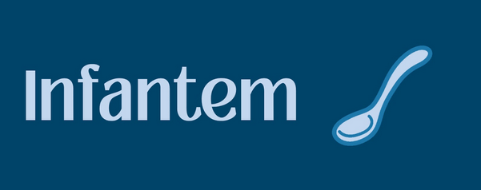

# INFORME USO DE LA IA

**Fecha:** 18/02/2025  
**Grupo 8:** Infantem  
**Ideando un proyecto**

---

### Integrantes del grupo

- Álvaro Jiménez Osuna  
- Ángela López Oliva  
- Antonio Jiménez Ortega  
- Daniel del Castillo Piñero  
- David Fuentelsaz Rodríguez  
- David Vargas Muñiz  
- Enrique García Abadía  
- Felipe Solís Agudo  
- Javier Santos Martín  
- Javier Ulecia García  
- José García de Tejada Delgado  
- Jose Maria Morgado Prudencio  
- Josué Rodríguez López  
- Lucía Noya Cano  
- Luis Giraldo Santiago  
- Miguel Galán Lerate  
- Paula Luna Navarro  

---

## Índice

1. [Introducción](#1-introducción)  
2. [Aplicaciones de la IA en el Proyecto](#2-aplicaciones-de-la-inteligencia-artificial-en-el-proyecto)  
3. [Herramientas de IA Utilizadas](#3-herramientas-de-ia-empleadas)  
4. [Consideraciones sobre el Uso Responsable de la IA](#4-consideraciones-sobre-el-uso-responsable-de-la-ia)  
5. [Conclusión](#5-conclusión)  

---

## 1. Introducción

En este informe se presenta un análisis detallado sobre la incorporación de herramientas de Inteligencia Artificial (IA) en el desarrollo del proyecto. La IA ha demostrado ser una tecnología clave en la optimización de procesos dentro del ámbito del desarrollo de software, proporcionando mejoras significativas en la automatización de tareas, la toma de decisiones y la eficiencia general de los flujos de trabajo.

El propósito de este documento es describir las herramientas de IA utilizadas en el desarrollo del producto, explicar sus aplicaciones concretas y evaluar los beneficios y desafíos que conlleva su implementación. A través de este análisis, se busca demostrar el impacto positivo de la IA en la productividad y la calidad del producto final, así como destacar la importancia de un uso ético y responsable de estas tecnologías.

---

## 2. Aplicaciones de la Inteligencia Artificial en el Proyecto

La Inteligencia Artificial desempeña un papel fundamental en diversas áreas del desarrollo del software, facilitando el trabajo del equipo y optimizando distintas tareas. A continuación, se detallan las principales aplicaciones de la IA en nuestro proyecto:

- **Automatización de tareas repetitivas:** La IA permite reducir el tiempo y esfuerzo dedicado a tareas rutinarias, minimizando el margen de error y aumentando la eficiencia del equipo.  
- **Asistencia en la generación de código:** Gracias a herramientas basadas en IA, es posible recibir sugerencias inteligentes para la escritura de código, así como detectar errores en tiempo real, lo que contribuye a mejorar la calidad y la velocidad del desarrollo.  
- **Optimización de la documentación técnica:** La IA facilita la generación, resumen y mejora de documentos técnicos, manuales de usuario e informes, lo que permite una mejor comprensión y mantenimiento del proyecto.  
- **Apoyo en la toma de decisiones:** A través del análisis de datos y la generación de alternativas, la IA ayuda en la toma de decisiones estratégicas dentro del desarrollo del producto, permitiendo evaluar diferentes opciones y seleccionar las más adecuadas.  

Estas aplicaciones ponen de manifiesto la importancia de la IA en la optimización del flujo de trabajo, mejorando la productividad y reduciendo la carga de tareas manuales del equipo.

---

## 3. Herramientas de IA Empleadas

Para llevar a cabo estas aplicaciones, se han seleccionado herramientas específicas que nos permitirán potenciar nuestro desarrollo. Las principales herramientas utilizadas son:

- **GitHub Copilot:** Esta herramienta basada en IA proporciona asistencia inteligente en la escritura de código, sugiriendo fragmentos de código, detectando errores y mejorando la eficiencia del desarrollo. Su integración en el entorno de trabajo agiliza la programación y facilita la solución de problemas en tiempo real.

- **ChatGPT:** Además de contribuir a la generación y mejora de código, ChatGPT es una herramienta valiosa para la elaboración de documentación técnica, informes y presentaciones. También ayuda a resolver dudas sobre implementación, depuración de código y optimización de algoritmos.

- **Banani:** Es una herramienta de diseño de interfaces de usuario (UI) potenciada por inteligencia artificial que facilita la creación de prototipos interactivos y diseños de UI de manera eficiente. Permite a los usuarios generar prototipos clicables y editables a partir de descripciones textuales, sin necesidad de habilidades previas en diseño. Además, ofrece un editor sin código para modificar y ajustar los diseños según las necesidades del proyecto.

Estas herramientas desempeñan un papel crucial en la automatización de tareas, la mejora de la productividad y la toma de decisiones dentro del proyecto.

---

## 4. Consideraciones sobre el Uso Responsable de la IA

Si bien las herramientas de Inteligencia Artificial ofrecen numerosas ventajas y facilitan el desarrollo del software, es fundamental hacer un uso responsable de estas tecnologías. El equipo se compromete a emplear la IA como un recurso de apoyo, sin reemplazar el criterio y la creatividad humana en la toma de decisiones.

Algunos aspectos clave a considerar incluyen:

- **Supervisión y validación humana:** Todas las soluciones propuestas por la IA serán revisadas y aprobadas por los miembros del equipo para garantizar su precisión y adecuación a los objetivos del proyecto.  
- **Ética y transparencia:** Se evitará la dependencia excesiva de la IA en la generación de contenido y se priorizará la originalidad y calidad del trabajo realizado por el equipo.  
- **Seguridad y privacidad:** Se prestará especial atención al manejo de datos sensibles y a la implementación de medidas de seguridad para evitar riesgos relacionados con el uso de herramientas de IA.  

En definitiva, la IA será utilizada como una herramienta complementaria que potenciará las capacidades del equipo sin sustituir el razonamiento crítico ni la experiencia profesional de los integrantes del proyecto.

---

## 5. Conclusión

La incorporación de la Inteligencia Artificial en el desarrollo de este proyecto ha supuesto una mejora significativa en la eficiencia del trabajo, la calidad del código y la generación de documentación técnica. Gracias a herramientas como GitHub Copilot y ChatGPT, se ha logrado optimizar procesos, reducir tiempos de desarrollo y minimizar errores, permitiendo al equipo centrarse en aspectos más estratégicos e innovadores.

Sin embargo, es fundamental destacar que el uso de la IA no reemplaza el criterio humano, sino que lo complementa. La toma de decisiones, la supervisión y la creatividad seguirán siendo responsabilidad del equipo, garantizando así la calidad y fiabilidad del producto final.

El equipo se compromete a seguir utilizando estas tecnologías de manera ética, asegurando que la IA sea un recurso de apoyo sin comprometer la integridad y originalidad del trabajo. De esta manera, se podrá aprovechar al máximo su potencial sin perder de vista la importancia del factor humano en el desarrollo del software.
